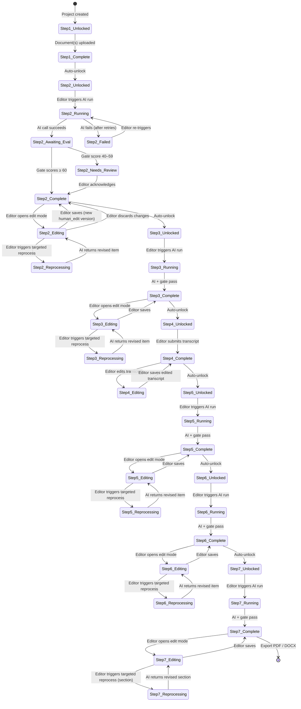

# OPERIA — Master Requirements Document
## Architectural · Functional · Technical Specification with AI Solution Design

---

**Document ID:** OPERIA-MRD-001  
**Version:** 2.0  
**Status:** Approved for Development  
**Classification:** Internal — Engineering & Product  
**Prepared by:** Senior Solutions Architect  
**Basis:** Technical Specification v1 · Architectural Review v2 · Developer Onboarding Guide v1  
**Amendment:** Human Editorial Control — Manual Adaptation & AI Re-processing for Steps 2–7

---

## Document Control

| Section | Owner | Last Updated |
|---|---|---|
| Product Vision & Goals | Product | v2.0 |
| Functional Requirements | Product + Engineering | v2.0 |
| Architectural Requirements | Solutions Architecture | v2.0 |
| Data Architecture | Backend Engineering | v2.0 |
| AI Solution Design | AI Engineering | v2.0 |
| Security & Compliance | Security + Engineering | v1.0 |
| Frontend Architecture | Frontend Engineering | v2.0 |
| Infrastructure | DevOps | v1.0 |
| Testing Strategy | QA Engineering | v2.0 |
| Implementation Roadmap | Engineering Management | v2.0 |

---

## Table of Contents

1. [Product Vision & Strategic Goals](#1-product-vision--strategic-goals)
2. [Target Users & Personas](#2-target-users--personas)
3. [Functional Requirements](#3-functional-requirements)
4. [Architectural Requirements](#4-architectural-requirements)
5. [Data Architecture](#5-data-architecture)
6. [AI Solution Design](#6-ai-solution-design)
7. [Security & Compliance Requirements](#7-security--compliance-requirements)
8. [Frontend Architecture Requirements](#8-frontend-architecture-requirements)
9. [Backend & Edge Function Architecture](#9-backend--edge-function-architecture)
10. [Infrastructure Requirements](#10-infrastructure-requirements)
11. [Integration Requirements](#11-integration-requirements)
12. [Performance Requirements](#12-performance-requirements)
13. [Testing Strategy](#13-testing-strategy)
14. [Implementation Roadmap](#14-implementation-roadmap)
15. [Appendix — Full Schema Reference](#15-appendix--full-schema-reference)
16. [Appendix — Full TypeScript Interface Reference](#16-appendix--full-typescript-interface-reference)
17. [Appendix — System Diagrams](#17-appendix--system-diagrams)
18. [Amendment — Human Editorial Control System](#18-amendment--human-editorial-control-system)

---

## 1. Product Vision & Strategic Goals

### 1.1 Vision Statement

Operia is a B2B SaaS platform that transforms how AI consultants deliver diagnostic engagements to SMEs. It replaces the ad-hoc, document-heavy consulting process with a structured, AI-augmented pipeline that produces consistent, auditable, and client-ready automation roadmaps — in a fraction of the time of a traditional engagement.

The core promise: **a consultant uploads a client's documents, walks through a guided AI-assisted diagnostic, and delivers a professional ROI-backed automation roadmap within hours, not weeks.**

### 1.2 Strategic Goals

**SG-01 — Pipeline Consistency**  
Every consulting engagement on Operia must follow the same 7-step diagnostic methodology. No step can be skipped. The platform enforces consulting discipline at the system level, not through process documentation.

**SG-02 — AI as Co-Analyst, Not Ghost-Writer**  
The AI generates hypotheses and structures output, but a human consultant validates interview findings before the AI produces solutions. The Human Breakpoint (Step 4) is non-negotiable and must never be automated away, even in premium tiers.

**SG-03 — Multi-Tenant Isolation**  
Operia handles confidential SME operational data. One client's data must be provably inaccessible to any other tenant's users, enforced at the database layer, not just the application layer.

**SG-04 — Auditability of AI Reasoning**  
Every AI output must be traceable: which model produced it, what version, when, what the quality scores were, and which human actions preceded it. This is both a trust feature for consultants and a liability protection for Operia.

**SG-05 — Resilience Over Speed**  
The pipeline must complete reliably even if the AI gateway is temporarily unavailable, the consultant's browser disconnects, or a step produces a quality-gate failure. Resilience is a product requirement, not just an engineering preference.

**SG-06 — Multilingual-First**  
The platform serves francophone, anglophone, and Dutch-speaking markets. All AI-generated content must support output in French, English, and Dutch. The UI must be fully internationalized from day one.

**SG-07 — Human Editorial Authority**  
The consultant is always the final author of every deliverable. AI output at every step is a proposal, not a conclusion. The platform must provide — at every AI-driven step and at the Human Breakpoint — structured tools to review, manually amend, and selectively re-process AI-generated content via targeted AI calls, without invalidating surrounding context. The human's edited state is always the canonical version that downstream steps consume.

### 1.3 Out of Scope for v1.0

The following are explicitly excluded from the v1.0 build:

- Audio transcription (Step 4 accepts text transcripts only; audio-to-text pipeline is v1.1)
- Automated report delivery to clients (consultants download and send manually)
- Billing / subscription management (handled via external platform at launch)
- Mobile native applications (responsive web only)
- White-labelling / custom domains for consultant firms

---

## 2. Target Users & Personas

### 2.1 Primary Persona — The Independent AI Consultant

**Profile:** Solo or small-firm consultant (1–5 people) specializing in AI and automation advisory for SMEs. Technically literate but not a developer. Manages 3–8 active client projects simultaneously. Typically based in France, Belgium, or the Netherlands.

**Pain points addressed by Operia:**
- Inconsistent diagnostic methodology across client engagements
- Time lost reformatting AI outputs into client-ready documents
- No structured audit trail when AI-generated advice is challenged by a client
- Difficulty scaling delivery without hiring additional analysts

**Key workflows on Operia:**
- Creating and managing consulting projects
- Uploading and ingesting SME documents
- Reviewing and editing AI-generated hypotheses
- Uploading interview transcripts after stakeholder sessions
- Reviewing gap analyses and approving solution roadmaps
- Exporting and delivering final reports

### 2.2 Secondary Persona — The Project Collaborator (Editor)

**Profile:** A junior analyst or second consultant added to a project by the project owner. Has full read-write access to all workflow steps but cannot delete the project or change project settings.

**Key workflows:** All Step interactions (review, re-run, edit outputs). Cannot invite additional collaborators.

### 2.3 Tertiary Persona — The Client Observer (Viewer)

**Profile:** An invited representative from the SME client who has been granted view-only access to a project. Can see completed step outputs and the final report. Cannot trigger any pipeline actions.

**Key constraint:** Viewer access to `workflow_nodes` must be enforced at the RLS level, not the UI level.

### 2.4 Platform Administrator

**Profile:** Internal Operia staff. Has access to system-level observability: pipeline execution logs, quality gate score distributions, error rates per Edge Function. Does not have access to client project content.

---

## 3. Functional Requirements

Requirements are tagged with priority: **[P0]** = must-have for launch, **[P1]** = important, **[P2]** = nice-to-have.

### 3.1 Authentication & Account Management

**FR-AUTH-01 [P0]** The system shall support email/password authentication via Supabase Auth.  
**FR-AUTH-02 [P0]** The system shall support OAuth authentication via Google as a social provider.  
**FR-AUTH-03 [P0]** Password reset via email must be supported.  
**FR-AUTH-04 [P1]** Session tokens must expire after 24 hours of inactivity. Refresh tokens must be rotated on each use.  
**FR-AUTH-05 [P1]** Users must be able to manage their profile: name, email, preferred language (fr/en/nl).  
**FR-AUTH-06 [P2]** Multi-factor authentication (TOTP) shall be available as an opt-in security feature.

### 3.2 Project Management

**FR-PROJ-01 [P0]** Authenticated users shall be able to create a consulting project. A project requires: client name, industry, country, language, and a brief context description.  
**FR-PROJ-02 [P0]** Project creators (owners) shall be able to invite collaborators by email, assigning them either `editor` or `viewer` role.  
**FR-PROJ-03 [P0]** Invited collaborators shall receive an email invitation. They must accept before gaining access.  
**FR-PROJ-04 [P0]** Project owners shall be able to revoke collaborator access at any time. Revocation takes effect immediately at the RLS level.  
**FR-PROJ-05 [P0]** A project dashboard shall display all projects accessible to the authenticated user, with their current pipeline status.  
**FR-PROJ-06 [P1]** Project owners shall be able to archive (soft-delete) projects. Archived projects are hidden from the dashboard but data is retained.  
**FR-PROJ-07 [P1]** Project owners shall be able to duplicate a project template (metadata only, no nodes or documents) to accelerate setup for similar engagements.

### 3.3 The 7-Step Pipeline

#### Step 1 — Knowledge Ingestion

**FR-S1-01 [P0]** The system shall allow editors to upload one or more documents to a project. Supported formats: PDF, DOCX, TXT. Maximum file size: 25 MB per file. Maximum files per project: 20.  
**FR-S1-02 [P0]** Uploaded documents shall be stored in a private Supabase Storage bucket. They must not be publicly accessible via direct URL.  
**FR-S1-03 [P0]** Document metadata (filename, size, MIME type, upload timestamp, uploader user ID) shall be written to the `project_documents` table.  
**FR-S1-04 [P0]** Once at least one document is uploaded, the system shall create a `workflow_node` for Step 1 with `execution_status = 'completed'`, unlocking Step 2.  
**FR-S1-05 [P1]** The system shall display a document list with upload status, size, and the ability to remove documents before Step 2 is triggered.  
**FR-S1-06 [P1]** The system shall provide a context summary text field (max 500 words) where the consultant describes the SME's context before triggering Step 2.

#### Step 2 — Hypothesis Generation

**FR-S2-01 [P0]** Once Step 1 is completed, editors shall be able to trigger hypothesis generation. The trigger call goes exclusively to the `pipeline-orchestrator` Edge Function, never directly to the AI step function.  
**FR-S2-02 [P0]** The system shall display a processing state while hypothesis generation is in progress, updated in real-time via Supabase Realtime.  
**FR-S2-03 [P0]** Upon completion, the system shall display the list of identified operational bottlenecks, each with title, description, severity, affected processes, and automation potential.  
**FR-S2-04 [P0]** The quality evaluation score (Pragmatism + ROI Focus) shall be displayed via the `AIQualityBadge` component once async evaluation completes.

**Human Editorial Controls — Step 2:**

**FR-S2-HEC-01 [P0]** Every bottleneck in the AI-generated list shall be individually editable inline. Editable fields: title, description, severity, affected processes, automation potential.  
**FR-S2-HEC-02 [P0]** Editors shall be able to add a new bottleneck manually via an "Add bottleneck" form. Manually created bottlenecks are tagged with `origin: 'human'` in the data model to distinguish them from AI-generated items (`origin: 'ai'`).  
**FR-S2-HEC-03 [P0]** Editors shall be able to delete any individual bottleneck from the list. Deletion requires a single confirmation click; there is no undo for this action within a given version.  
**FR-S2-HEC-04 [P0]** After making manual edits, the editor shall be able to save the edited state. Saving writes a new `workflow_node` version with `edit_source: 'human_edit'` and `output_data` reflecting the amended list. The previous AI-generated version is retained.  
**FR-S2-HEC-05 [P0]** Editors shall be able to select one or more bottlenecks and trigger a **targeted AI re-process** ("Regenerate this item") for those specific items. The system sends the selected bottleneck's current content plus the original document context to the AI and returns a revised version of that item only, without affecting other bottlenecks.  
**FR-S2-HEC-06 [P1]** Editors shall be able to trigger a **full AI re-run** of Step 2. A full re-run creates a new versioned node from scratch from the original documents, discarding all manual edits from the current version.  
**FR-S2-HEC-07 [P1]** The UI shall display a visual indicator (icon or label) on each bottleneck showing its current origin: `AI Generated`, `Human Edited`, `AI Re-processed`, or `Human Added`.

#### Step 3 — Interview Architect

**FR-S3-01 [P0]** Once Step 2 quality gate passes, editors shall be able to specify target stakeholder roles (text input, comma-separated) and trigger interview guide generation.  
**FR-S3-02 [P0]** The generated interview guide shall be displayed in a structured format: introduction script, question list (with intent and linked bottleneck), estimated duration, and closing script.

**Human Editorial Controls — Step 3:**

**FR-S3-HEC-01 [P0]** Every individual question in the generated guide shall be editable inline. Editable fields: question text, intent, linked bottleneck (dropdown from Step 2's active bottleneck list), expected answer type.  
**FR-S3-HEC-02 [P0]** Editors shall be able to add new questions manually. Manually added questions are tagged `origin: 'human'`.  
**FR-S3-HEC-03 [P0]** Editors shall be able to delete any question and reorder the question list via drag-and-drop.  
**FR-S3-HEC-04 [P0]** The introduction script and closing script shall be editable as free-text rich-text fields.  
**FR-S3-HEC-05 [P0]** Editors shall be able to select one or more questions and trigger a **targeted AI re-process** for those questions, optionally providing a free-text refinement instruction (e.g., "Make this question more direct" or "Split into two questions"). The AI returns revised versions of the selected questions only.  
**FR-S3-HEC-06 [P0]** After making any edits, saving creates a new versioned node with `edit_source: 'human_edit'`.  
**FR-S3-HEC-07 [P1]** Editors shall be able to trigger a full AI re-run of Step 3 with updated stakeholder roles or a different set of active bottlenecks as input.  
**FR-S3-HEC-08 [P1]** Editors shall be able to export the interview guide as PDF or DOCX. The export reflects the currently saved (human-edited) version, not the raw AI output.

#### Step 4 — Human Breakpoint

**FR-S4-01 [P0]** Step 4 shall require a manual human action to advance. It cannot be automatically triggered or bypassed.  
**FR-S4-02 [P0]** Editors shall be able to upload one or more interview transcript files (TXT, DOCX) or paste transcript text directly into a rich text field.  
**FR-S4-03 [P0]** Editors shall record interview metadata: interview date, list of stakeholders interviewed, and optional notes.  
**FR-S4-04 [P0]** Upon submission, the Step 4 `workflow_node` shall be created with `execution_status = 'completed'`, unlocking Step 5.  
**FR-S4-05 [P1]** The UI shall display a clear visual indicator emphasizing that this step represents human-validated data entering the pipeline (distinguished from AI-generated steps).

**Human Editorial Controls — Step 4:**

**FR-S4-HEC-01 [P0]** The submitted transcript text shall be fully editable after initial submission. Editors shall be able to open the transcript in an in-app rich text editor, make corrections (e.g., fix transcription errors, redact sensitive information), and save the edited version.  
**FR-S4-HEC-02 [P0]** Saving an edited transcript creates a new versioned Step 4 node with `edit_source: 'human_edit'`. The previous transcript version is retained and the version history panel displays both.  
**FR-S4-HEC-03 [P0]** Editors shall be able to add supplementary notes alongside the transcript — structured annotations that are passed to Step 5 as additional context alongside the transcript text. These notes do not replace the transcript; they augment it.  
**FR-S4-HEC-04 [P1]** Editors shall be able to request a **targeted AI assistance** call on the raw transcript: "Summarize this transcript section" or "Extract all action items mentioned". This is an assistive annotation tool only — the AI output is appended as a note and does not replace the transcript or automatically populate Step 5 inputs.  
**FR-S4-HEC-05 [P1]** Editors shall be able to replace the entire transcript (upload a new file or paste new text) after initial submission. Replacement creates a new node version and marks the previous version as superseded.  
**FR-S4-HEC-06 [P1]** The UI shall clearly display which version of the transcript will be used as input for Step 5, with a "Use this version" selector if multiple versions exist.

#### Step 5 — Gap Analysis

**FR-S5-01 [P0]** Once Step 4 is completed, editors shall be able to trigger gap analysis. The trigger routes through the `pipeline-orchestrator`.  
**FR-S5-02 [P0]** Gap analysis output shall be displayed as a structured list of findings: each original hypothesis, confirmation status, evidence quote from transcript, and revised severity rating.  
**FR-S5-03 [P0]** Any newly discovered bottlenecks (found in the transcript but not in the hypothesis) shall be clearly distinguished from validated hypotheses.  
**FR-S5-04 [P0]** An overall hypothesis-to-reality alignment score (0–100) shall be displayed with contextual explanation.

**Human Editorial Controls — Step 5:**

**FR-S5-HEC-01 [P0]** Every individual gap finding shall be editable inline. Editable fields: confirmation status (override from AI's assessment), discrepancy description, evidence quote, revised severity.  
**FR-S5-HEC-02 [P0]** Editors shall be able to manually add gap findings not identified by the AI — for example, an insight from the interview that the AI missed. Manually added findings are tagged `origin: 'human'`.  
**FR-S5-HEC-03 [P0]** Editors shall be able to delete any gap finding they consider irrelevant or erroneous.  
**FR-S5-HEC-04 [P0]** Editors shall be able to add free-text **consultant annotations** to any gap finding — structured notes that are passed forward to Step 6 as supplementary context alongside the structured finding data.  
**FR-S5-HEC-05 [P0]** Editors shall be able to select one or more gap findings and trigger a **targeted AI re-process** for those specific findings, optionally providing a refinement instruction (e.g., "Look more carefully at this bottleneck — the transcript mentions it implicitly in the third section"). The AI is provided the finding, the original hypothesis, the full transcript, and the editor's instruction; it returns a revised finding only.  
**FR-S5-HEC-06 [P0]** After all edits, saving creates a new versioned Step 5 node with `edit_source: 'human_edit'`. This human-edited version becomes the input to Step 6.  
**FR-S5-HEC-07 [P1]** Editors shall be able to trigger a full AI re-run of Step 5, which re-processes from the current active Step 2 and Step 4 nodes (respecting any manual edits made in those steps).

#### Step 6 — Solution Architect

**FR-S6-01 [P0]** Once Step 5 quality gate passes, editors shall be able to trigger solution generation. The SME profile (industry, employee count, country) shall be pre-populated from the project metadata and editable before triggering.  
**FR-S6-02 [P0]** Each generated solution shall display: title, description, target bottleneck link, technology stack recommendation, implementation complexity, and a fully itemized ROI estimate with explicit assumptions.  
**FR-S6-03 [P0]** An implementation roadmap with phases, dependencies, and duration estimates shall be displayed.  
**FR-S6-04 [P0]** A total aggregated ROI estimate for the full engagement shall be prominently displayed.

**Human Editorial Controls — Step 6:**

**FR-S6-HEC-01 [P0]** Every individual solution shall be editable inline. Editable fields: title, description, technology stack (add/remove items), implementation complexity, and all ROI estimate fields (time saved, cost reduction, payback period, confidence, assumptions).  
**FR-S6-HEC-02 [P0]** Editors shall be able to add solutions manually. Manually created solutions are tagged `origin: 'human'`.  
**FR-S6-HEC-03 [P0]** Editors shall be able to delete any solution. Deleting a solution removes it from the roadmap phases that reference it.  
**FR-S6-HEC-04 [P0]** Editors shall be able to toggle individual solutions in or out of the active roadmap without deleting them. Excluded solutions are retained in the version data but excluded from the report.  
**FR-S6-HEC-05 [P0]** Editors shall be able to edit roadmap phases: rename phases, reassign solutions to different phases, and adjust duration estimates.  
**FR-S6-HEC-06 [P0]** Editors shall be able to select one or more solutions and trigger a **targeted AI re-process** for those solutions, with an optional refinement instruction (e.g., "Focus on low-cost automation tools suitable for a 15-person company" or "Recalculate ROI using a €35/hr labour cost assumption"). The AI returns revised versions of the selected solutions only.  
**FR-S6-HEC-07 [P0]** After all edits, saving creates a new versioned Step 6 node with `edit_source: 'human_edit'`. The human-edited version is the canonical input to Step 7.  
**FR-S6-HEC-08 [P1]** Editors shall be able to trigger a full AI re-run of Step 6, which re-processes from the current active Step 5 node with the current SME profile.  
**FR-S6-HEC-09 [P1]** The total ROI figure displayed shall update in real-time as editors modify individual solution ROI fields, so consultants can see the engagement-level impact of their edits immediately.

#### Step 7 — Reporting

**FR-S7-01 [P0]** Once Step 6 quality gate passes, editors shall be able to configure and trigger report generation: client name, consultant name, report language (fr/en/nl), and whether to include the quality gate appendix.  
**FR-S7-02 [P0]** The generated report shall be rendered in-app and shall include: executive summary, key findings, solution overview, full roadmap, and ROI summary.  
**FR-S7-03 [P0]** The report shall be exportable as a downloadable PDF via a generated signed Storage URL.

**Human Editorial Controls — Step 7:**

**FR-S7-HEC-01 [P0]** The in-app rendered report shall be editable section by section. Each named section (executive summary, key findings, solution overview, roadmap, ROI summary) shall display an "Edit" mode that renders the section as a rich-text field. Changes are saved to the node's `output_data` in a `human_overrides` map keyed by section name.  
**FR-S7-HEC-02 [P0]** Editors shall be able to select any individual report section and trigger a **targeted AI re-process** for that section, with an optional instruction (e.g., "Make the executive summary shorter and more executive-friendly" or "Rephrase the key findings in French using formal register"). The AI is provided the current section content, the project context, and the instruction; it returns a revised version of that section only.  
**FR-S7-HEC-03 [P0]** A "Regenerate full report" action shall be available, which triggers a full re-run of Step 7 from the current active Step 6 node, resetting all `human_overrides` for this version. The editor must explicitly confirm this action as it clears manual section edits.  
**FR-S7-HEC-04 [P0]** After any human edits to the report, saving creates a new versioned Step 7 node with `edit_source: 'human_edit'`. The PDF export always reflects the most recently saved version.  
**FR-S7-HEC-05 [P0]** The export (PDF) must render from the human-edited version, including all `human_overrides`, not from the raw AI output.  
**FR-S7-HEC-06 [P1]** Editors shall be able to add a **Consultant Commentary** section to the report — a free-text section written entirely by the consultant, not AI-generated, clearly labelled as such in the exported document.  
**FR-S7-HEC-07 [P1]** The report shall optionally be exportable as a DOCX file that is itself editable, allowing final light-touch formatting adjustments outside the platform.

### 3.4 AI Quality Gate System

**FR-QG-01 [P0]** After every AI-driven step (Steps 2, 3, 5, 6, 7), an async quality evaluation shall be triggered automatically via a database event, without blocking step completion.  
**FR-QG-02 [P0]** Each quality evaluation shall produce a score for Pragmatism (0–100) and ROI Focus (0–100), plus a written rationale.  
**FR-QG-03 [P0]** The `AIQualityBadge` component shall display current evaluation status (pending, evaluating, passed, failed, needs_review) for each AI step.  
**FR-QG-04 [P1]** If a quality gate scores below a configurable threshold (default: 60 for either dimension), the step status shall be marked `needs_review` and the consultant shall be prompted to review before proceeding.  
**FR-QG-05 [P1]** Consultants shall be able to override a `needs_review` gate with an explicit acknowledgment, creating an audit log entry.

### 3.5 Node Versioning & Re-run

**FR-VER-01 [P0]** Re-running any AI step shall create a new versioned `workflow_node` row, not overwrite the existing one.  
**FR-VER-02 [P0]** The pipeline shall always use the highest-version completed node for a given step when resolving dependencies.  
**FR-VER-03 [P1]** The UI shall display a version history panel for each step, allowing consultants to compare outputs across versions.  
**FR-VER-04 [P1]** Consultants shall be able to explicitly pin a previous version as the active version for a step, making downstream steps resolve from that version.

---

## 4. Architectural Requirements

### 4.1 Core Architectural Principles

**AR-01 — Server-Side Pipeline Orchestration**  
The pipeline must be orchestrated server-side. The React client is a display and trigger surface only. No client code shall invoke AI step functions directly. All pipeline advancement goes through the `pipeline-orchestrator` Edge Function, which is the sole authority for determining what executes next.

*Rationale: Client disconnection (tab close, mobile network drop, browser crash) must not leave the pipeline in an unrecoverable state.*

**AR-02 — Idempotent Operations**  
Every Edge Function that writes to `workflow_nodes` must be idempotent. Re-delivery of the same trigger (e.g., a DB webhook firing twice due to network retry) must produce exactly one node row, not two.

*Implementation: All node-writing operations use a unique `idempotency_key` (composed of `project_id + step_type + version + trigger_timestamp`) checked before insert.*

**AR-03 — Immutable Node History**  
`workflow_nodes` rows shall never be updated after creation (except for `execution_status` transitioning from `running` to `completed` or `failed`). Re-runs produce new rows with an incremented `version`. The previous version's `superseded_by` is set to the new row's ID.

**AR-04 — Asynchronous Quality Evaluation**  
Quality evaluation is never in the critical path of a pipeline step. Steps complete based on AI call success alone. Quality scoring fires as a background process via a database event webhook, independent of step execution.

**AR-05 — AI Provider Abstraction**  
All AI calls are made through an `AIProvider` interface. The concrete implementation (Lovable AI Gateway) is injected at runtime. A fallback implementation (Anthropic Claude) is configured for automatic failover. No pipeline logic has any knowledge of which specific AI provider is active.

**AR-06 — Zero-Trust Data Access**  
No Edge Function that processes AI calls shall hold the `SUPABASE_SERVICE_ROLE_KEY`. All AI-processing functions access the database via the `SUPABASE_ANON_KEY` plus RLS, or via scoped `SECURITY DEFINER` stored procedures. The service role key is restricted to storage operations exclusively.

**AR-07 — Realtime-Driven UI Updates**  
The frontend shall not poll for pipeline state. All state updates (node completions, quality gate results, execution status changes) shall arrive via Supabase Realtime subscriptions. The UI is a reactive view of database state.

**AR-08 — Separation of Concerns in Frontend**  
No React component shall simultaneously own server state, business logic, and presentation. Server state lives in custom hooks. Step gating logic lives in a dedicated hook. Components are presentational consumers of hook outputs.

**AR-09 — Human Edits Are First-Class Versions**  
A human edit to any step's output is architecturally equivalent to a new AI execution. Both produce a new versioned `workflow_node` row. Both are tracked in the audit trail with their origin (`ai_generated` or `human_edit`). Downstream steps always resolve from the latest completed node regardless of whether it was produced by AI or human editing. There is no "raw AI" vs "human-modified" two-track system — there is only one node history, and the most recent completed version is canonical.

**AR-10 — Targeted Re-process via Scoped AI Calls**  
Targeted re-processing of individual items (a single bottleneck, a single question, a single gap finding, a single solution, a single report section) must not trigger a full pipeline step re-execution. These are scoped AI calls — they receive only the item in question plus necessary context, return a structured replacement for that item only, and the result is merged into the current node's `output_data` by the client before saving as a new human-edit version. The `pipeline-orchestrator` is not involved in targeted re-process calls; they go through a dedicated `targeted-reprocess` Edge Function.

### 4.2 System Architecture Overview

```
┌──────────────────────────────────────────────────────────────────┐
│                        REACT FRONTEND                            │
│  ┌──────────────┐  ┌─────────────────┐  ┌────────────────────┐  │
│  │ useWorkflow  │  │  useStepGating  │  │  Step Panel        │  │
│  │ State()      │  │  ()             │  │  Components        │  │
│  │ (Realtime)   │  │  (unlock logic) │  │  (presentational)  │  │
│  └──────┬───────┘  └────────┬────────┘  └─────────┬──────────┘  │
│         │                   │                      │             │
│  ┌──────▼───────────────────▼──────────────────────▼──────────┐  │
│  │              WorkflowStepper.tsx (orchestrator UI)         │  │
│  └──────────────────────────┬───────────────────────────────── ┘  │
└─────────────────────────────┼────────────────────────────────────┘
                              │ invoke('pipeline-orchestrator')
                              ▼
┌─────────────────────────────────────────────────────────────────┐
│                   SUPABASE EDGE FUNCTIONS                        │
│                                                                  │
│   pipeline-orchestrator  ←──── single entry point from client   │
│          │                                                       │
│          ├──► generate-hypothesis   ─┐                          │
│          ├──► generate-interview    ─┤──► AI Provider Layer     │
│          ├──► analyze-gaps          ─┤    (Lovable Gateway /    │
│          ├──► generate-solutions    ─┤     Anthropic Fallback)  │
│          └──► generate-report       ─┘                          │
│                                                                  │
│   evaluate-output  ◄──── DB trigger (async, not in pipeline)    │
│   storage-signer   ◄──── signed URL generation (service role)   │
└───────────────────────────┬─────────────────────────────────────┘
                            │
            ┌───────────────▼───────────────┐
            │      POSTGRESQL (Supabase)     │
            │                               │
            │  consulting_projects          │
            │  workflow_nodes (versioned)   │
            │  pipeline_executions          │
            │  project_collaborators        │
            │  project_documents            │
            │  ai_quality_gates             │
            │  active_workflow_nodes (VIEW) │
            │                               │
            │  SECURITY DEFINER RPCs        │
            │  RLS Policies                 │
            └───────────────────────────────┘
```

---

## 5. Data Architecture

### 5.1 Complete Schema Definition

#### Table: `consulting_projects`

```sql
CREATE TABLE consulting_projects (
  id                  UUID PRIMARY KEY DEFAULT gen_random_uuid(),
  owner_id            UUID NOT NULL REFERENCES auth.users(id) ON DELETE CASCADE,
  name                TEXT NOT NULL,
  client_name         TEXT NOT NULL,
  industry            TEXT NOT NULL,
  country             CHAR(2) NOT NULL,              -- ISO 3166-1 alpha-2
  language            CHAR(2) NOT NULL DEFAULT 'fr'  -- fr | en | nl
                      CHECK (language IN ('fr', 'en', 'nl')),
  context_summary     TEXT,
  status              TEXT NOT NULL DEFAULT 'active'
                      CHECK (status IN ('active', 'archived', 'completed')),
  current_step        TEXT NOT NULL DEFAULT 'knowledge_ingestion',
  sme_profile         JSONB,                         -- SMEProfile object
  created_at          TIMESTAMPTZ DEFAULT NOW(),
  updated_at          TIMESTAMPTZ DEFAULT NOW()
);

CREATE INDEX idx_consulting_projects_owner ON consulting_projects(owner_id);
CREATE INDEX idx_consulting_projects_status ON consulting_projects(status);
```

#### Table: `project_documents`

```sql
CREATE TABLE project_documents (
  id              UUID PRIMARY KEY DEFAULT gen_random_uuid(),
  project_id      UUID NOT NULL REFERENCES consulting_projects(id) ON DELETE CASCADE,
  uploaded_by     UUID NOT NULL REFERENCES auth.users(id),
  storage_path    TEXT NOT NULL UNIQUE,              -- path in project-documents bucket
  filename        TEXT NOT NULL,
  mime_type       TEXT NOT NULL,
  size_bytes      BIGINT NOT NULL,
  status          TEXT NOT NULL DEFAULT 'uploaded'
                  CHECK (status IN ('uploaded', 'ingested', 'failed')),
  created_at      TIMESTAMPTZ DEFAULT NOW()
);

CREATE INDEX idx_project_documents_project ON project_documents(project_id);
```

#### Table: `workflow_nodes`

```sql
CREATE TABLE workflow_nodes (
  id                UUID PRIMARY KEY DEFAULT gen_random_uuid(),
  project_id        UUID NOT NULL REFERENCES consulting_projects(id) ON DELETE CASCADE,
  step_type         TEXT NOT NULL
                    CHECK (step_type IN (
                      'knowledge_ingestion', 'hypothesis_generation',
                      'interview_architect', 'human_breakpoint',
                      'gap_analysis', 'solution_architect', 'reporting'
                    )),
  version           INTEGER NOT NULL DEFAULT 1,
  superseded_by     UUID REFERENCES workflow_nodes(id),
  execution_status  TEXT NOT NULL DEFAULT 'pending'
                    CHECK (execution_status IN (
                      'pending', 'running', 'completed', 'failed', 'retrying'
                    )),
  retry_count       INTEGER NOT NULL DEFAULT 0,
  idempotency_key   TEXT UNIQUE,
  input_data        JSONB,                           -- node ID references only
  output_data       JSONB,                           -- AI-generated structured output
  human_overrides   JSONB,                           -- v2: keyed section overrides for human edits
  edit_source       TEXT NOT NULL DEFAULT 'ai_generated'
                    CHECK (edit_source IN ('ai_generated', 'human_edit')),
  error_message     TEXT,
  triggered_by      UUID REFERENCES auth.users(id),
  created_at        TIMESTAMPTZ DEFAULT NOW(),
  updated_at        TIMESTAMPTZ DEFAULT NOW(),

  UNIQUE (project_id, step_type, version)
);

CREATE INDEX idx_workflow_nodes_project ON workflow_nodes(project_id);
CREATE INDEX idx_workflow_nodes_project_step ON workflow_nodes(project_id, step_type);
CREATE INDEX idx_workflow_nodes_status ON workflow_nodes(execution_status);
```

#### View: `active_workflow_nodes`

```sql
CREATE VIEW active_workflow_nodes AS
SELECT DISTINCT ON (project_id, step_type)
  wn.*
FROM workflow_nodes wn
WHERE execution_status = 'completed'
  AND superseded_by IS NULL
ORDER BY project_id, step_type, version DESC;
```

#### Table: `pipeline_executions`

```sql
CREATE TABLE pipeline_executions (
  id              UUID PRIMARY KEY DEFAULT gen_random_uuid(),
  project_id      UUID NOT NULL REFERENCES consulting_projects(id) ON DELETE CASCADE,
  triggered_by    UUID REFERENCES auth.users(id),
  step_type       TEXT NOT NULL,
  status          TEXT NOT NULL DEFAULT 'queued'
                  CHECK (status IN ('queued', 'running', 'completed', 'failed')),
  queued_at       TIMESTAMPTZ DEFAULT NOW(),
  started_at      TIMESTAMPTZ,
  completed_at    TIMESTAMPTZ,
  error_message   TEXT,
  node_id         UUID REFERENCES workflow_nodes(id),   -- set on completion
  retry_of        UUID REFERENCES pipeline_executions(id)
);

CREATE INDEX idx_pipeline_executions_project ON pipeline_executions(project_id);
CREATE INDEX idx_pipeline_executions_status ON pipeline_executions(status);
```

#### Table: `project_collaborators`

```sql
CREATE TABLE project_collaborators (
  id          UUID PRIMARY KEY DEFAULT gen_random_uuid(),
  project_id  UUID NOT NULL REFERENCES consulting_projects(id) ON DELETE CASCADE,
  user_id     UUID REFERENCES auth.users(id),
  email       TEXT NOT NULL,                         -- for pending (pre-accept) invitations
  role        TEXT NOT NULL CHECK (role IN ('editor', 'viewer')),
  status      TEXT NOT NULL DEFAULT 'pending'
              CHECK (status IN ('pending', 'accepted', 'revoked')),
  invited_by  UUID NOT NULL REFERENCES auth.users(id),
  invited_at  TIMESTAMPTZ DEFAULT NOW(),
  accepted_at TIMESTAMPTZ,

  UNIQUE (project_id, email)
);

CREATE INDEX idx_collaborators_project ON project_collaborators(project_id);
CREATE INDEX idx_collaborators_user ON project_collaborators(user_id);
```

#### Table: `ai_quality_gates`

```sql
CREATE TABLE ai_quality_gates (
  id                  UUID PRIMARY KEY DEFAULT gen_random_uuid(),
  node_id             UUID NOT NULL REFERENCES workflow_nodes(id) ON DELETE CASCADE,
  project_id          UUID NOT NULL REFERENCES consulting_projects(id) ON DELETE CASCADE,
  pragmatism_score    SMALLINT CHECK (pragmatism_score BETWEEN 0 AND 100),
  roi_focus_score     SMALLINT CHECK (roi_focus_score BETWEEN 0 AND 100),
  rationale           TEXT,
  status              TEXT NOT NULL DEFAULT 'pending'
                      CHECK (status IN ('pending', 'passed', 'failed', 'overridden')),
  evaluation_status   TEXT NOT NULL DEFAULT 'pending'
                      CHECK (evaluation_status IN ('pending', 'evaluating', 'completed', 'skipped')),
  evaluated_async     BOOLEAN DEFAULT TRUE,
  overridden_by       UUID REFERENCES auth.users(id),
  override_reason     TEXT,
  evaluated_at        TIMESTAMPTZ,
  created_at          TIMESTAMPTZ DEFAULT NOW()
);

CREATE UNIQUE INDEX idx_quality_gates_node ON ai_quality_gates(node_id);
CREATE INDEX idx_quality_gates_project ON ai_quality_gates(project_id);
```

#### Table: `targeted_reprocess_calls`

Tracks all scoped AI re-process calls made by editors on individual items. Provides a complete audit trail of human-directed AI refinements separate from full pipeline executions.

```sql
CREATE TABLE targeted_reprocess_calls (
  id                UUID PRIMARY KEY DEFAULT gen_random_uuid(),
  project_id        UUID NOT NULL REFERENCES consulting_projects(id) ON DELETE CASCADE,
  source_node_id    UUID NOT NULL REFERENCES workflow_nodes(id),
  step_type         TEXT NOT NULL,
  triggered_by      UUID NOT NULL REFERENCES auth.users(id),
  item_type         TEXT NOT NULL,     -- 'bottleneck'|'question'|'gap_finding'|'solution'|'report_section'
  item_id           TEXT NOT NULL,     -- the id field of the targeted item within output_data
  instruction       TEXT,              -- optional human refinement instruction
  input_snapshot    JSONB NOT NULL,    -- the item's state at time of re-process call
  ai_response       JSONB,             -- what the AI returned
  applied           BOOLEAN DEFAULT FALSE,   -- did editor accept and apply the result?
  applied_to_node   UUID REFERENCES workflow_nodes(id),  -- the human_edit node that used this result
  model_metadata    JSONB,             -- ModelCallMetadata
  created_at        TIMESTAMPTZ DEFAULT NOW()
);

CREATE INDEX idx_reprocess_project ON targeted_reprocess_calls(project_id);
CREATE INDEX idx_reprocess_node ON targeted_reprocess_calls(source_node_id);
CREATE INDEX idx_reprocess_user ON targeted_reprocess_calls(triggered_by);
```

### 5.2 RLS Policy Specification

#### `consulting_projects` RLS

```sql
ALTER TABLE consulting_projects ENABLE ROW LEVEL SECURITY;

-- Owners can do everything
CREATE POLICY "owners_full_access" ON consulting_projects
  FOR ALL USING (owner_id = auth.uid());

-- Accepted collaborators can read
CREATE POLICY "collaborators_read" ON consulting_projects
  FOR SELECT USING (
    EXISTS (
      SELECT 1 FROM project_collaborators pc
      WHERE pc.project_id = id
        AND pc.user_id = auth.uid()
        AND pc.status = 'accepted'
    )
  );
```

#### `workflow_nodes` RLS

```sql
ALTER TABLE workflow_nodes ENABLE ROW LEVEL SECURITY;

-- Read: owners and accepted collaborators (any role)
CREATE POLICY "project_members_read_nodes" ON workflow_nodes
  FOR SELECT USING (
    is_project_member(project_id, auth.uid())
  );

-- Write: owners and accepted editors only
CREATE POLICY "editors_write_nodes" ON workflow_nodes
  FOR INSERT WITH CHECK (
    is_project_editor(project_id, auth.uid())
  );
```

#### `is_project_editor` Function

```sql
CREATE OR REPLACE FUNCTION is_project_editor(p_project_id UUID, p_user_id UUID)
RETURNS BOOLEAN
LANGUAGE plpgsql
SECURITY DEFINER
SET search_path = public
AS $$
BEGIN
  -- Owner check
  IF EXISTS (
    SELECT 1 FROM consulting_projects
    WHERE id = p_project_id AND owner_id = p_user_id
  ) THEN RETURN TRUE; END IF;

  -- Accepted editor collaborator check
  RETURN EXISTS (
    SELECT 1 FROM project_collaborators
    WHERE project_id = p_project_id
      AND user_id = p_user_id
      AND status = 'accepted'
      AND role = 'editor'
  );
END;
$$;

CREATE OR REPLACE FUNCTION is_project_member(p_project_id UUID, p_user_id UUID)
RETURNS BOOLEAN
LANGUAGE plpgsql
SECURITY DEFINER
SET search_path = public
AS $$
BEGIN
  IF EXISTS (
    SELECT 1 FROM consulting_projects
    WHERE id = p_project_id AND owner_id = p_user_id
  ) THEN RETURN TRUE; END IF;

  RETURN EXISTS (
    SELECT 1 FROM project_collaborators
    WHERE project_id = p_project_id
      AND user_id = p_user_id
      AND status = 'accepted'
  );
END;
$$;
```

### 5.3 Scoped RPC: `insert_workflow_node`

```sql
CREATE OR REPLACE FUNCTION insert_workflow_node(
  p_project_id      UUID,
  p_step_type       TEXT,
  p_input_data      JSONB,
  p_output_data     JSONB,
  p_idempotency_key TEXT,
  p_triggered_by    UUID DEFAULT NULL
)
RETURNS UUID
LANGUAGE plpgsql
SECURITY DEFINER
SET search_path = public
AS $$
DECLARE
  v_node_id UUID;
  v_version INTEGER;
BEGIN
  -- Idempotency guard: return existing ID if already inserted
  SELECT id INTO v_node_id
  FROM workflow_nodes
  WHERE idempotency_key = p_idempotency_key;

  IF FOUND THEN
    RETURN v_node_id;
  END IF;

  -- Calculate next version for this project+step combination
  SELECT COALESCE(MAX(version), 0) + 1
  INTO v_version
  FROM workflow_nodes
  WHERE project_id = p_project_id
    AND step_type = p_step_type;

  -- Mark previous active version as superseded
  UPDATE workflow_nodes
  SET superseded_by = NULL  -- will be set after insert
  WHERE project_id = p_project_id
    AND step_type = p_step_type
    AND superseded_by IS NULL
    AND execution_status = 'completed';

  -- Insert new node
  INSERT INTO workflow_nodes (
    project_id, step_type, version, input_data, output_data,
    idempotency_key, execution_status, triggered_by
  )
  VALUES (
    p_project_id, p_step_type, v_version, p_input_data, p_output_data,
    p_idempotency_key, 'completed', p_triggered_by
  )
  RETURNING id INTO v_node_id;

  -- Point previous versions to new one
  UPDATE workflow_nodes
  SET superseded_by = v_node_id
  WHERE project_id = p_project_id
    AND step_type = p_step_type
    AND id != v_node_id
    AND superseded_by IS NULL;

  -- Trigger async quality gate evaluation via pg_net
  PERFORM net.http_post(
    url := current_setting('app.edge_function_url') || '/evaluate-output',
    body := json_build_object('node_id', v_node_id, 'project_id', p_project_id)::text,
    headers := '{"Content-Type": "application/json", "Authorization": "Bearer ' ||
                current_setting('app.supabase_anon_key') || '"}'
  );

  RETURN v_node_id;
END;
$$;
```

### 5.4 Scoped RPC: `insert_human_edit_node`

This RPC is called when a consultant saves manual edits to a step's output. It is structurally identical to `insert_workflow_node` but sets `edit_source = 'human_edit'` and accepts a `human_overrides` JSONB argument for report section overrides. Unlike `insert_workflow_node`, it does **not** trigger the async quality gate — human-edited nodes are not re-evaluated by the quality system.

```sql
CREATE OR REPLACE FUNCTION insert_human_edit_node(
  p_project_id        UUID,
  p_step_type         TEXT,
  p_input_data        JSONB,
  p_output_data       JSONB,
  p_human_overrides   JSONB DEFAULT NULL,
  p_triggered_by      UUID DEFAULT NULL
)
RETURNS UUID
LANGUAGE plpgsql
SECURITY DEFINER
SET search_path = public
AS $$
DECLARE
  v_node_id UUID;
  v_version INTEGER;
BEGIN
  -- Calculate next version
  SELECT COALESCE(MAX(version), 0) + 1
  INTO v_version
  FROM workflow_nodes
  WHERE project_id = p_project_id AND step_type = p_step_type;

  -- Supersede previous active version
  UPDATE workflow_nodes
  SET superseded_by = NULL
  WHERE project_id = p_project_id
    AND step_type = p_step_type
    AND superseded_by IS NULL
    AND execution_status = 'completed';

  -- Insert human-edit node (no idempotency key needed — human saves are intentional)
  INSERT INTO workflow_nodes (
    project_id, step_type, version,
    input_data, output_data, human_overrides,
    edit_source, execution_status, triggered_by
  )
  VALUES (
    p_project_id, p_step_type, v_version,
    p_input_data, p_output_data, p_human_overrides,
    'human_edit', 'completed', p_triggered_by
  )
  RETURNING id INTO v_node_id;

  -- Point previous versions to new one
  UPDATE workflow_nodes
  SET superseded_by = v_node_id
  WHERE project_id = p_project_id
    AND step_type = p_step_type
    AND id != v_node_id
    AND superseded_by IS NULL;

  -- No quality gate trigger for human edits
  RETURN v_node_id;
END;
$$;
```

### 6.1 AI Architecture Overview

The AI layer in Operia is designed around three principles: **abstraction** (no pipeline logic knows which model is active), **resilience** (automatic fallback on provider failure), and **auditability** (every AI call is logged with full provenance metadata).

### 6.2 AI Provider Abstraction Layer

All Edge Functions import and use the `AIProvider` interface. The concrete provider is instantiated by a factory function that reads from environment configuration.

```typescript
// ai-provider/types.ts
export interface AIMessage {
  role: 'system' | 'user' | 'assistant';
  content: string;
}

export interface AIPrompt {
  system: string;
  messages: AIMessage[];
  max_tokens?: number;
  temperature?: number;
  response_format?: 'text' | 'json';
}

export interface AIResponse {
  content: string;
  provider: string;
  model_id: string;
  prompt_tokens: number;
  completion_tokens: number;
  latency_ms: number;
  called_at: string;
}

export interface AIProvider {
  readonly name: string;
  readonly model: string;
  complete(prompt: AIPrompt): Promise<AIResponse>;
}
```

```typescript
// ai-provider/factory.ts
export function createAIProvider(): AIProvider {
  return new LovableGatewayProvider(Deno.env.get('LOVABLE_API_KEY')!);
}

export function createFallbackProvider(): AIProvider {
  return new AnthropicProvider(Deno.env.get('FALLBACK_ANTHROPIC_API_KEY')!);
}

export async function callAIWithFallback(prompt: AIPrompt): Promise<AIResponse> {
  const primary = createAIProvider();
  try {
    return await primary.complete(prompt);
  } catch (primaryError) {
    console.error(`[AI] Primary provider (${primary.name}) failed:`, primaryError);
    const fallback = createFallbackProvider();
    try {
      const response = await fallback.complete(prompt);
      console.warn(`[AI] Serving via fallback provider: ${fallback.name}`);
      return response;
    } catch (fallbackError) {
      console.error(`[AI] Fallback provider (${fallback.name}) also failed:`, fallbackError);
      throw new Error(`All AI providers unavailable. Primary: ${primaryError}. Fallback: ${fallbackError}`);
    }
  }
}
```

### 6.3 Prompt Engineering Specification

Each pipeline step has a dedicated, versioned system prompt. Prompts follow a strict structure:

1. **Role definition** — establishes the AI as a specialized business analyst
2. **Task framing** — precise description of what to produce
3. **Output schema** — mandatory JSON output structure with examples
4. **Quality constraints** — explicit instructions against hallucination, generic advice, and non-actionable outputs
5. **Language instruction** — explicit output language directive

#### Step 2 — Hypothesis Generation Prompt

```
SYSTEM:
You are a senior business operations analyst specializing in SME process improvement 
and automation readiness assessment. You analyze business documents to identify 
concrete operational bottlenecks that are candidates for AI and automation solutions.

TASK:
Analyze the provided document excerpts from [SME_CLIENT_NAME], an SME in the 
[INDUSTRY] sector in [COUNTRY]. Identify operational bottlenecks that:
1. Have clear, demonstrable inefficiency (not vague organizational issues)
2. Can plausibly be addressed by AI/automation tools available to an SME
3. Have measurable impact on time, cost, or quality

OUTPUT FORMAT (respond ONLY with valid JSON, no preamble):
{
  "bottlenecks": [
    {
      "id": "b_[sequential_number]",
      "title": "Short descriptive title (max 8 words)",
      "description": "2-3 sentences describing the bottleneck precisely",
      "severity": "low|medium|high",
      "affected_processes": ["process name 1", "process name 2"],
      "automation_potential": "low|medium|high",
      "evidence_basis": "Direct quote or paraphrase from the documents"
    }
  ],
  "automation_candidates": ["general opportunity 1", "general opportunity 2"]
}

QUALITY CONSTRAINTS:
- Minimum 3 bottlenecks, maximum 8
- Each bottleneck must cite specific evidence from the documents (evidence_basis field)
- Do not generate generic bottlenecks (e.g., "lack of digital tools") — be specific to this SME
- severity='high' requires clear business impact evidence
- Respond in [LANGUAGE]
```

#### Step 5 — Gap Analysis Prompt

```
SYSTEM:
You are a senior management consultant performing a rigorous gap analysis between 
AI-generated preliminary hypotheses and real-world stakeholder interview findings. 
Your role is to be the critical bridge between desk research and field reality.

TASK:
Compare the provided AI hypotheses against the interview transcript. For each hypothesis:
1. Determine whether it was confirmed, partially confirmed, or contradicted by the interview
2. Extract specific evidence quotes from the transcript
3. Identify any new bottlenecks discovered that were not in the original hypotheses

CRITICAL RULES:
- Never mark a hypothesis as 'confirmed' unless the transcript contains direct supporting evidence
- The transcript is ground truth. If it contradicts a hypothesis, the hypothesis is wrong
- If a bottleneck is not mentioned in the transcript, mark it as 'unconfirmed' (not 'confirmed')

OUTPUT FORMAT (respond ONLY with valid JSON):
{
  "gap_findings": [
    {
      "id": "gf_[sequential_number]",
      "bottleneck_id": "[original bottleneck id from hypotheses]",
      "confirmed": true|false,
      "discrepancy_description": "null if confirmed, otherwise explain the gap",
      "evidence_quote": "Exact quote or close paraphrase from transcript",
      "revised_severity": "low|medium|high|eliminated"
    }
  ],
  "new_bottlenecks": [...same structure as hypothesis bottlenecks...],
  "overall_alignment_score": 0-100,
  "analyst_summary": "2-3 paragraph narrative summary of findings"
}
```

#### Quality Evaluation Prompt (Step `evaluate-output`)

```
SYSTEM:
You are an AI output quality reviewer for a consulting platform. You score AI-generated 
consulting content on two dimensions relevant to SME AI consulting engagements.

SCORING DIMENSIONS:
1. PRAGMATISM (0-100): Is the content specific, actionable, and grounded in the 
   provided context? Penalize: vague outputs, generic advice, hallucinated specifics.
2. ROI_FOCUS (0-100): Does the content maintain clear business value orientation? 
   Are impacts quantifiable or at least estimable? Penalize: academic framing, 
   outputs with no connection to time/cost/quality impact.

THRESHOLDS: scores below 60 on either dimension = 'failed'. Both >= 60 = 'passed'.

OUTPUT FORMAT (respond ONLY with valid JSON):
{
  "pragmatism_score": 0-100,
  "roi_focus_score": 0-100,
  "rationale": "2-3 sentence explanation of the scores",
  "status": "passed|failed"
}
```

### 6.4 Prompt Injection Mitigation

All user-supplied content (SME documents, interview transcripts) must be wrapped in structural XML tags before being passed to AI models. This signals to the model that the wrapped content is data to be analyzed, not instructions to be followed.

```typescript
function sanitizeDocumentContent(chunks: string[]): string {
  return chunks
    .map((chunk, i) => `<document_excerpt index="${i}">\n${chunk}\n</document_excerpt>`)
    .join('\n\n');
}

function sanitizeTranscriptContent(transcript: string): string {
  return `<interview_transcript>\n${transcript}\n</interview_transcript>`;
}
```

Additionally, implement a pre-flight check that rejects any document chunk containing phrases commonly used in prompt injection attacks:

```typescript
const INJECTION_PATTERNS = [
  /ignore previous instructions/i,
  /system prompt/i,
  /you are now/i,
  /disregard the above/i,
  /act as/i,
];

function containsInjectionAttempt(text: string): boolean {
  return INJECTION_PATTERNS.some(pattern => pattern.test(text));
}
```

### 6.5 Token Budget Management

Large SME documents can exceed model context windows. Implement a chunking and summarization strategy:

```typescript
const TOKEN_BUDGETS = {
  hypothesis_generation: {
    max_context_tokens: 32000,
    chunk_size_tokens: 4000,
    overlap_tokens: 200,
    strategy: 'hierarchical_summary',  // summarize each doc, then synthesize
  },
  gap_analysis: {
    max_context_tokens: 48000,
    chunk_size_tokens: 6000,
    overlap_tokens: 300,
    strategy: 'full_context',          // transcript must be complete
  },
};
```

If the total document token count exceeds `max_context_tokens`, the `generate-hypothesis` Edge Function shall:

1. Process each document independently to extract key facts (pass 1)
2. Synthesize the per-document summaries into a final hypothesis pass (pass 2)
3. Log both passes in `model_metadata` with token counts

### 6.6 AI Quality Gate Scoring Thresholds

| Threshold | Status | UI Indicator | User Action Required |
|---|---|---|---|
| Both scores ≥ 75 | `passed` | Green badge | None — automatic advance |
| Both scores ≥ 60 | `passed` | Green badge | None — automatic advance |
| Either score 40–59 | `needs_review` | Amber badge | Consultant must acknowledge |
| Either score < 40 | `failed` | Red badge | Consultant must re-run or override |

---

## 7. Security & Compliance Requirements

### 7.1 Authentication & Authorization

**SEC-AUTH-01** All API endpoints (Edge Functions) must verify a valid Supabase JWT before processing any request. Unauthenticated requests return HTTP 401.

**SEC-AUTH-02** The `pipeline-orchestrator` must verify that the calling user has `editor` access to the specified project via `is_project_editor()` before queuing any execution. An unauthorized call returns HTTP 403.

**SEC-AUTH-03** The `SUPABASE_SERVICE_ROLE_KEY` must be present only in the `storage-signer` Edge Function environment. It must not be set in any other function's secrets.

### 7.2 Data Isolation

**SEC-ISO-01** RLS must be enabled on all tables containing project data: `consulting_projects`, `workflow_nodes`, `project_documents`, `project_collaborators`, `ai_quality_gates`, `pipeline_executions`.

**SEC-ISO-02** RLS policies must be validated via automated integration tests that attempt cross-tenant data access with a second user's JWT. These tests must be part of the CI pipeline.

**SEC-ISO-03** Storage buckets must be configured as private. No object URL may be publicly accessible. All client access to documents must be via time-limited signed URLs generated server-side.

### 7.3 Secrets Management

**SEC-SECRET-01** All secrets (`LOVABLE_API_KEY`, `FALLBACK_ANTHROPIC_API_KEY`, `SUPABASE_SERVICE_ROLE_KEY`) must be stored as Supabase Edge Function secrets. They must never appear in source code, `.env` files committed to version control, or client-side bundles.

**SEC-SECRET-02** API keys must be rotated on a 90-day schedule. The rotation process must be documented and executable without downtime.

### 7.4 GDPR Compliance (Belgium/EU)

**SEC-GDPR-01** All SME client data is processed under a Data Processing Agreement. Operia acts as Data Processor; the consultant acts as Data Controller.

**SEC-GDPR-02** Project data (documents, transcripts, AI outputs) must be permanently deletable on consultant request. Deletion must cascade through all related tables and storage objects.

**SEC-GDPR-03** AI-generated content must not be used to train AI models without explicit consent. No project data shall be sent to AI providers in a way that could allow model training (use of `X-Stainless-Arch: production` or equivalent provider opt-out headers where available).

**SEC-GDPR-04** Data at rest is encrypted by Supabase (AES-256). Data in transit must use TLS 1.2 minimum.

**SEC-GDPR-05** Data processing is restricted to EU data centers. The Supabase project must be hosted in the `eu-west-1` (Ireland) or `eu-central-1` (Frankfurt) region.

---

## 8. Frontend Architecture Requirements

### 8.1 Technology Stack

| Concern | Technology | Version |
|---|---|---|
| Framework | React | 18.x |
| Language | TypeScript | 5.x (strict mode) |
| Styling | Tailwind CSS | 3.x |
| Component library | shadcn/ui | Latest |
| State management | React hooks + useReducer | (no external state library) |
| Routing | React Router | v6 |
| Backend client | @supabase/supabase-js | 2.x |
| Form handling | React Hook Form + Zod | Latest |
| i18n | react-i18next | Latest |
| Build tool | Vite | Latest |

### 8.2 Project Structure

```
src/
├── components/
│   ├── ui/                          # shadcn/ui primitives
│   ├── workflow/
│   │   ├── WorkflowStepper.tsx      # Presentational orchestrator
│   │   ├── AIQualityBadge.tsx       # Display-only quality gate badge
│   │   ├── StepStatusIndicator.tsx  # Per-step status dot/icon
│   │   ├── editorial/               # v2: Human Editorial Control components
│   │   │   ├── EditableItem.tsx     # Generic inline-edit wrapper
│   │   │   ├── OriginBadge.tsx      # ai_generated / human_edit / human_added label
│   │   │   ├── ReprocessButton.tsx  # Targeted AI re-process trigger
│   │   │   ├── ReprocessPanel.tsx   # Instruction input + result preview
│   │   │   └── SaveEditBar.tsx      # Sticky save/discard bar shown while editing
│   │   └── steps/
│   │       ├── Step1KnowledgeIngestion.tsx
│   │       ├── Step2HypothesisGeneration.tsx
│   │       ├── Step3InterviewArchitect.tsx
│   │       ├── Step4HumanBreakpoint.tsx
│   │       ├── Step5GapAnalysis.tsx
│   │       ├── Step6SolutionArchitect.tsx
│   │       └── Step7Reporting.tsx
│   ├── projects/
│   │   ├── ProjectCard.tsx
│   │   ├── ProjectCreateModal.tsx
│   │   └── CollaboratorManager.tsx
│   └── layout/
│       ├── AppShell.tsx
│       └── Navigation.tsx
├── hooks/
│   ├── useWorkflowState.ts          # Server state + Realtime subscriptions
│   ├── useStepGating.ts             # Step unlock + quality gate logic
│   ├── usePipelineAdvance.ts        # Orchestrator invocation
│   ├── useStepEditor.ts             # v2: In-place editing state machine per step
│   ├── useTargetedReprocess.ts      # v2: Scoped AI re-process calls
│   └── useProject.ts               # Single project data
├── lib/
│   ├── supabase.ts                  # Supabase client singleton
│   ├── types.ts                     # All TypeScript interfaces (Section 16)
│   └── constants.ts                 # STEP_ORDER, thresholds, etc.
├── pages/
│   ├── Dashboard.tsx
│   ├── ProjectPage.tsx
│   └── Auth.tsx
├── i18n/
│   ├── fr.json
│   ├── en.json
│   └── nl.json
└── main.tsx
```

### 8.3 Hook Specifications

#### `useWorkflowState(projectId: string)`

**Responsibilities:**
- Fetches initial `workflow_nodes` and `ai_quality_gates` for the project on mount
- Subscribes to Supabase Realtime on `workflow_nodes` (INSERT, UPDATE) and `ai_quality_gates` (INSERT, UPDATE)
- Maintains a local `useReducer` state that is updated by Realtime events
- Exposes `advancePipeline(action)` which invokes `pipeline-orchestrator`

**Must NOT:**
- Contain any step unlock logic
- Contain any UI rendering
- Hold a reference to `setActiveStep` or any presentational state

#### `useStepGating(nodes: WorkflowNode[], gates: AIQualityGate[])`

**Responsibilities:**
- Compute `StepStatus` for each step from the current node and gate state
- Expose `isStepUnlocked(step)` and `getStepStatus(step)` as pure functions of input
- Use `useMemo` to avoid re-computation on unrelated renders

**Must NOT:**
- Make any Supabase calls
- Maintain any internal state (pure derived computation)
- Have any knowledge of UI concerns

#### `usePipelineAdvance(projectId: string)`

**Responsibilities:**
- Wraps the `supabase.functions.invoke('pipeline-orchestrator', ...)` call
- Manages loading and error state for the invocation
- Returns `{ advance, isAdvancing, advanceError }`

#### `useStepEditor<T>(stepType: WorkflowStep, activeNode: WorkflowNode<any, T>)`

This hook owns the complete editing lifecycle for a single step panel. It is the primary new hook introduced in v2.

**Responsibilities:**
- Maintains a local mutable draft of the step's `output_data` (a deep copy of `activeNode.output_data`)
- Tracks which items have been modified: `dirtyItems: Set<string>` (item IDs)
- Tracks `isDirty: boolean` — true if any change has been made since last save or discard
- Exposes `updateItem(itemId, patch)` — merges a partial update into the draft for one item
- Exposes `addItem(newItem)` — appends a new item tagged `origin: 'human'`
- Exposes `deleteItem(itemId)` — removes an item from the draft
- Exposes `applyReprocessResult(itemId, revisedItem, callId)` — replaces the item in the draft and records `callId` as pending-applied
- Exposes `save()` — calls `save-human-edit` Edge Function with draft state; resets dirty tracking
- Exposes `discard()` — resets draft to `activeNode.output_data`; clears dirty tracking
- Exposes `isSaving: boolean`

**Must NOT:**
- Make any Supabase calls other than via `save-human-edit` on `save()`
- Contain any presentation logic
- Be shared across multiple steps (one instance per mounted step panel)

```typescript
interface UseStepEditorReturn<T> {
  draft: T;
  isDirty: boolean;
  dirtyItems: Set<string>;
  isSaving: boolean;
  updateItem: (itemId: string, patch: Partial<unknown>) => void;
  addItem: (newItem: unknown) => void;
  deleteItem: (itemId: string) => void;
  applyReprocessResult: (itemId: string, revisedItem: unknown, callId: string) => void;
  save: () => Promise<{ node_id: string }>;
  discard: () => void;
}
```

#### `useTargetedReprocess(projectId: string, sourceNodeId: string)`

**Responsibilities:**
- Calls the `targeted-reprocess` Edge Function with the specified item details and optional instruction
- Manages per-item loading state: `isReprocessing: Record<string, boolean>` keyed by `item_id`
- Returns the AI's revised item for preview before the editor accepts or rejects it
- Tracks pending call IDs for the `save-human-edit` `applied_call_ids` parameter

```typescript
interface UseTargetedReprocessReturn {
  reprocess: (params: ReprocessRequest) => Promise<ReprocessResult>;
  isReprocessing: Record<string, boolean>;
  pendingCallIds: string[];
  clearPendingCalls: () => void;
}

interface ReprocessRequest {
  step_type: WorkflowStep;
  item_type: ItemType;
  item_id: string;
  instruction?: string;
}

interface ReprocessResult {
  call_id: string;
  revised_item: unknown;  // typed by step_type + item_type at call site
}
```

### 8.4 Internationalization Requirements

**I18N-01** All user-visible strings must be externalized to translation files. No hardcoded UI strings in component files.

**I18N-02** The active language must be stored in user profile (`auth.users` metadata) and synced to the `i18next` instance on login.

**I18N-03** AI-generated content language is controlled by the project's `language` field, independent of the consultant's UI language.

**I18N-04** Date, number, and currency formatting must use the `Intl` API with locale derived from the project's language.

---

## 9. Backend & Edge Function Architecture

### 9.1 Edge Function Inventory

| Function Name | Trigger | Auth Required | Service Role | Description |
|---|---|---|---|---|
| `pipeline-orchestrator` | Client HTTP POST | Yes (editor) | No | Routes pipeline advancement; queues step executions |
| `generate-hypothesis` | `pipeline_executions` DB trigger | No (internal) | No | AI: bottleneck identification from documents |
| `generate-interview` | `pipeline_executions` DB trigger | No (internal) | No | AI: interview guide generation from hypotheses |
| `analyze-gaps` | `pipeline_executions` DB trigger | No (internal) | No | AI: hypothesis vs. transcript gap analysis |
| `generate-solutions` | `pipeline_executions` DB trigger | No (internal) | No | AI: solution architecture and ROI calculation |
| `generate-report` | `pipeline_executions` DB trigger | No (internal) | No | AI: full report aggregation |
| `evaluate-output` | `workflow_nodes` DB trigger (async) | No (internal) | No | AI: quality scoring of completed node output |
| `targeted-reprocess` | Client HTTP POST | Yes (editor) | No | AI: scoped re-process of a single item within a step |
| `save-human-edit` | Client HTTP POST | Yes (editor) | No | Persists human-edited node via `insert_human_edit_node` RPC |
| `storage-signer` | Client HTTP POST | Yes (member) | **Yes** | Generates signed URLs for document/report download |

### 9.2 `pipeline-orchestrator` Logic

```typescript
// Pseudocode — full implementation required
export async function pipelineOrchestrator(req: Request): Promise<Response> {
  const { project_id, action } = await req.json();
  const user = await verifyJWT(req);

  // Authorization
  const { data: isEditor } = await supabase.rpc('is_project_editor', {
    p_project_id: project_id,
    p_user_id: user.id,
  });
  if (!isEditor) return new Response('Forbidden', { status: 403 });

  // Determine next step to execute
  const nextStep = await resolveNextStep(project_id, action);
  if (!nextStep) return new Response(JSON.stringify({ status: 'up_to_date' }), { status: 200 });

  // Check for in-flight execution (prevent double-trigger)
  const { data: existing } = await supabase
    .from('pipeline_executions')
    .select('id')
    .eq('project_id', project_id)
    .eq('step_type', nextStep)
    .in('status', ['queued', 'running'])
    .single();

  if (existing) {
    return new Response(JSON.stringify({ status: 'already_queued', step: nextStep }), { status: 200 });
  }

  // Queue the execution
  const { data: execution } = await supabase
    .from('pipeline_executions')
    .insert({ project_id, step_type: nextStep, triggered_by: user.id, status: 'queued' })
    .select()
    .single();

  // Invoke step function asynchronously (non-blocking)
  EdgeRuntime.waitUntil(
    supabase.functions.invoke(STEP_FUNCTION_MAP[nextStep], {
      body: { execution_id: execution.id, project_id, triggered_by: user.id },
    })
  );

  return new Response(JSON.stringify({ status: 'queued', step: nextStep, execution_id: execution.id }), { status: 202 });
}
```

### 9.3 Generic AI Step Function Template

All 5 AI step functions follow this structure:

```typescript
export async function genericAIStep(req: Request, config: StepConfig): Promise<Response> {
  const { execution_id, project_id, triggered_by } = await req.json();

  // Mark execution as running
  await supabase.from('pipeline_executions')
    .update({ status: 'running', started_at: new Date().toISOString() })
    .eq('id', execution_id);

  try {
    // 1. Resolve input data (fetch referenced nodes from active_workflow_nodes view)
    const inputData = await resolveInputData(project_id, config.requiredNodes);

    // 2. Build prompt with sanitized content
    const prompt = config.buildPrompt(inputData);

    // 3. Call AI with fallback
    const aiResponse = await callAIWithFallback(prompt);

    // 4. Parse and validate AI output
    const parsedOutput = config.parseOutput(aiResponse.content);

    // 5. Write node via scoped RPC (idempotent)
    const idempotencyKey = `${project_id}:${config.stepType}:${execution_id}`;
    const nodeId = await supabase.rpc('insert_workflow_node', {
      p_project_id: project_id,
      p_step_type: config.stepType,
      p_input_data: inputData.references,   // IDs only
      p_output_data: { ...parsedOutput, model_metadata: aiResponse },
      p_idempotency_key: idempotencyKey,
      p_triggered_by: triggered_by,
    });

    // 6. Mark execution completed
    await supabase.from('pipeline_executions')
      .update({ status: 'completed', completed_at: new Date().toISOString(), node_id: nodeId })
      .eq('id', execution_id);

    return new Response(JSON.stringify({ status: 'completed', node_id: nodeId }), { status: 200 });

  } catch (error) {
    // Retry logic
    const { data: exec } = await supabase.from('pipeline_executions')
      .select('retry_of').eq('id', execution_id).single();

    const retryCount = exec?.retry_of ? /* count chain */ 1 : 0;

    if (retryCount < MAX_RETRIES) {
      // Re-queue with backoff
      await requeueWithBackoff(execution_id, project_id, config.stepType, triggered_by, retryCount);
    } else {
      await supabase.from('pipeline_executions')
        .update({ status: 'failed', error_message: error.message, completed_at: new Date().toISOString() })
        .eq('id', execution_id);
    }

    throw error;
  }
}
```

### 9.4 Retry Policy

| Attempt | Delay before retry | Max attempts |
|---|---|---|
| 1st retry | 5 seconds | — |
| 2nd retry | 30 seconds | — |
| 3rd retry | 5 minutes | Final |
| After 3rd failure | Mark execution `failed` | Dead-letter to `pipeline_executions` |

Retry state is tracked via the `retry_of` foreign key chain in `pipeline_executions`.

### 9.5 `targeted-reprocess` Edge Function

This function handles scoped AI refinement calls on individual items within a step's output. It is called directly by the client (not through the orchestrator) and returns a structured AI-generated replacement for the targeted item only.

```typescript
export async function targetedReprocess(req: Request): Promise<Response> {
  const {
    project_id,
    source_node_id,
    step_type,
    item_type,       // 'bottleneck' | 'question' | 'gap_finding' | 'solution' | 'report_section'
    item_id,         // stable id of the item within output_data
    instruction,     // optional human refinement instruction
  } = await req.json();

  const user = await verifyJWT(req);

  // Authorization
  const { data: isEditor } = await supabase.rpc('is_project_editor', {
    p_project_id: project_id,
    p_user_id: user.id,
  });
  if (!isEditor) return new Response('Forbidden', { status: 403 });

  // Resolve current item from source node
  const { data: sourceNode } = await supabase
    .from('workflow_nodes')
    .select('output_data, input_data')
    .eq('id', source_node_id)
    .single();

  const currentItem = resolveItemById(sourceNode.output_data, item_type, item_id);
  if (!currentItem) return new Response('Item not found', { status: 404 });

  // Resolve supporting context (previous nodes as needed)
  const context = await resolveReprocessContext(project_id, step_type, sourceNode.input_data);

  // Build targeted prompt
  const prompt = buildTargetedReprocessPrompt({
    step_type,
    item_type,
    currentItem,
    context,
    instruction,
  });

  // AI call with fallback
  const aiResponse = await callAIWithFallback(prompt);
  const revisedItem = parseReprocessedItem(aiResponse.content, item_type);

  // Log the call (non-blocking)
  const callRecord = await supabase.from('targeted_reprocess_calls').insert({
    project_id,
    source_node_id,
    step_type,
    triggered_by: user.id,
    item_type,
    item_id,
    instruction,
    input_snapshot: currentItem,
    ai_response: revisedItem,
    model_metadata: {
      provider: aiResponse.provider,
      model_id: aiResponse.model_id,
      prompt_tokens: aiResponse.prompt_tokens,
      completion_tokens: aiResponse.completion_tokens,
      latency_ms: aiResponse.latency_ms,
      called_at: aiResponse.called_at,
    },
    applied: false,
  }).select().single();

  // Return revised item + call record ID (client uses call_id when saving)
  return new Response(JSON.stringify({
    call_id: callRecord.data.id,
    revised_item: revisedItem,
  }), { status: 200 });
}
```

**Targeted Prompt Structure per Item Type:**

```typescript
function buildTargetedReprocessPrompt(params: ReprocessParams): AIPrompt {
  const instructionClause = params.instruction
    ? `\n\nEditor instruction: "${params.instruction}"`
    : '';

  const prompts: Record<string, AIPrompt> = {
    bottleneck: {
      system: `You are revising a single operational bottleneck identified during an SME diagnostic. 
Return ONLY a revised JSON object for this one bottleneck, maintaining its id field.
Respond with nothing else — no preamble, no explanation.`,
      messages: [{
        role: 'user',
        content: `Current bottleneck:\n${JSON.stringify(params.currentItem, null, 2)}

Supporting document context:\n${params.context.documentSummary}${instructionClause}

Return the revised bottleneck as a JSON object with the same schema.`
      }],
      response_format: 'json',
    },

    question: {
      system: `You are revising a single interview question for an SME stakeholder interview guide.
Return ONLY the revised JSON object for this one question, maintaining its id field.`,
      messages: [{
        role: 'user',
        content: `Current question:\n${JSON.stringify(params.currentItem, null, 2)}

Available bottlenecks to link:\n${params.context.bottlenecks.map(b => `${b.id}: ${b.title}`).join('\n')}${instructionClause}

Return the revised question as a JSON object with the same schema.`
      }],
      response_format: 'json',
    },

    gap_finding: {
      system: `You are revising a single gap finding from a consulting gap analysis.
Return ONLY the revised JSON object for this one finding, maintaining its id field.`,
      messages: [{
        role: 'user',
        content: `Current finding:\n${JSON.stringify(params.currentItem, null, 2)}

Original hypothesis:\n${params.context.linkedBottleneck}

Interview transcript excerpt:\n${params.context.transcriptExcerpt}${instructionClause}

Return the revised finding as a JSON object with the same schema.`
      }],
      response_format: 'json',
    },

    solution: {
      system: `You are revising a single automation solution recommendation for an SME client.
Return ONLY the revised JSON object for this one solution, maintaining its id field.`,
      messages: [{
        role: 'user',
        content: `Current solution:\n${JSON.stringify(params.currentItem, null, 2)}

SME profile:\n${JSON.stringify(params.context.smeProfile)}

Target gap finding:\n${params.context.linkedGapFinding}${instructionClause}

Return the revised solution as a JSON object with the same schema.`
      }],
      response_format: 'json',
    },

    report_section: {
      system: `You are revising a single section of a consulting report for an SME client.
Return ONLY the revised text content for this section — no JSON wrapper, just the text.`,
      messages: [{
        role: 'user',
        content: `Section name: ${params.item_id}

Current content:\n${params.currentItem}

Project context:\n${params.context.reportContext}${instructionClause}

Return the revised section text in ${params.context.language}.`
      }],
      response_format: 'text',
    },
  };

  return prompts[params.item_type];
}
```

### 9.6 `save-human-edit` Edge Function

Called when the consultant saves their edited state for a step. Merges the client's modified `output_data` with any `human_overrides`, marks applied `targeted_reprocess_calls` records, and calls the `insert_human_edit_node` RPC.

```typescript
export async function saveHumanEdit(req: Request): Promise<Response> {
  const {
    project_id,
    step_type,
    source_node_id,        // the node being edited (for input_data reference)
    output_data,           // full modified output_data from client
    human_overrides,       // { section_name: string } map for Step 7
    applied_call_ids,      // targeted_reprocess_calls IDs that were applied
  } = await req.json();

  const user = await verifyJWT(req);

  const { data: isEditor } = await supabase.rpc('is_project_editor', {
    p_project_id: project_id, p_user_id: user.id,
  });
  if (!isEditor) return new Response('Forbidden', { status: 403 });

  // Retrieve source node's input_data (new node inherits same references)
  const { data: sourceNode } = await supabase
    .from('workflow_nodes').select('input_data').eq('id', source_node_id).single();

  // Write new human-edit versioned node
  const { data: newNodeId } = await supabase.rpc('insert_human_edit_node', {
    p_project_id: project_id,
    p_step_type: step_type,
    p_input_data: sourceNode.input_data,
    p_output_data: output_data,
    p_human_overrides: human_overrides ?? null,
    p_triggered_by: user.id,
  });

  // Mark applied reprocess calls
  if (applied_call_ids?.length) {
    await supabase.from('targeted_reprocess_calls')
      .update({ applied: true, applied_to_node: newNodeId })
      .in('id', applied_call_ids);
  }

  return new Response(JSON.stringify({ node_id: newNodeId }), { status: 201 });
}
```

---

## 10. Infrastructure Requirements

### 10.1 Supabase Configuration

| Component | Requirement |
|---|---|
| PostgreSQL | Supabase managed Postgres 15+ |
| Edge Functions | Deno runtime (latest stable) |
| Storage | Private buckets: `project-documents`, `report-exports` |
| Realtime | Enabled on: `workflow_nodes`, `ai_quality_gates`, `pipeline_executions` |
| Auth | Email/password + Google OAuth configured |
| Region | `eu-west-1` or `eu-central-1` (GDPR compliance) |
| pg_net extension | Required for async `evaluate-output` trigger from `insert_workflow_node` |

### 10.2 Frontend Hosting

The React SPA must be deployed to a CDN-backed host (Vercel, Netlify, or Cloudflare Pages). Requirements:

- Automatic HTTPS with TLS 1.2 minimum
- Deploy preview environments for every pull request
- Environment-specific Supabase URL/anon key configuration via build-time environment variables

### 10.3 Environment Configuration

| Variable | Location | Used by |
|---|---|---|
| `VITE_SUPABASE_URL` | Frontend `.env` | Supabase client |
| `VITE_SUPABASE_ANON_KEY` | Frontend `.env` | Supabase client |
| `LOVABLE_API_KEY` | Edge Function secrets | AI step functions |
| `FALLBACK_ANTHROPIC_API_KEY` | Edge Function secrets | Fallback provider |
| `SUPABASE_SERVICE_ROLE_KEY` | Edge Function secrets (storage-signer ONLY) | Signed URL generation |
| `SUPABASE_URL` | Edge Function secrets | Internal function calls |
| `SUPABASE_ANON_KEY` | Edge Function secrets | Scoped DB access in functions |

### 10.4 Monitoring & Observability

**OBS-01** All Edge Function executions must emit structured logs (JSON) with: `execution_id`, `project_id`, `step_type`, `duration_ms`, `ai_provider`, `token_count`, `status`.

**OBS-02** A Supabase monitoring dashboard (or equivalent: Grafana + Prometheus) must track: pipeline execution success rate per step, average AI latency per step, quality gate pass rate per step, error rate per Edge Function.

**OBS-03** Failed pipeline executions must trigger an alert to the platform operations team within 5 minutes. Alerting channel: email + Slack webhook (configurable).

---

## 11. Integration Requirements

### 11.1 Email (Transactional)

**INT-EMAIL-01** Transactional email (invitation emails, password reset) must be sent via a dedicated email service (Resend, Postmark, or SendGrid). Supabase's built-in SMTP is for development only.

**INT-EMAIL-02** Invitation emails must include: inviter's name, project name, role, and a time-limited accept link (expires in 72 hours).

### 11.2 Document Export

**INT-EXPORT-01** Report PDF generation must be handled server-side (Edge Function) using a headless rendering approach. Client-side PDF generation is not acceptable for production report quality.

**INT-EXPORT-02** Generated reports must be saved to the `report-exports` private storage bucket and delivered via signed URL with a 1-hour expiry.

---

## 12. Performance Requirements

| Metric | Requirement | Measurement point |
|---|---|---|
| Initial page load | < 2.5s (LCP) | Vercel Analytics / Web Vitals |
| Pipeline step trigger response | < 500ms | Time for `pipeline-orchestrator` to return 202 |
| AI step execution (p50) | < 30 seconds | `pipeline_executions.completed_at - started_at` |
| AI step execution (p95) | < 90 seconds | `pipeline_executions.completed_at - started_at` |
| Realtime UI update lag | < 2 seconds after DB write | Observed in testing |
| Quality gate evaluation | < 45 seconds | Async, does not block UI |
| Concurrent projects per user | Up to 10 active simultaneously | No degradation |
| Storage upload | < 60 seconds for 25 MB file | Client upload time |

---

## 13. Testing Strategy

### 13.1 Unit Tests

- All TypeScript interfaces validated with Zod schemas
- `useStepGating` hook: pure function, 100% branch coverage required
- AI prompt building functions: snapshot tests against expected prompt structures
- `sanitizeDocumentContent` and `containsInjectionAttempt`: security-critical, must include adversarial test cases

### 13.2 Integration Tests

- RLS policy tests: for each table, verify that:
  - Owners can read/write their own data
  - Accepted editors can read/write
  - Accepted viewers can read only
  - Non-members get zero rows (not 403 — RLS returns empty result sets)
  - Cross-tenant access returns zero rows

- Edge Function tests (using Supabase CLI + local Deno test runner):
  - `pipeline-orchestrator`: unauthorized call returns 403
  - `pipeline-orchestrator`: double-trigger returns `already_queued`
  - `insert_workflow_node`: idempotency key prevents duplicate rows
  - All AI step functions: invalid `execution_id` returns 422

### 13.3 End-to-End Tests (Playwright)

Critical user journeys requiring E2E coverage:

1. **Happy path**: Create project → upload documents → complete all 7 steps → download report
2. **Collaborator flow**: Invite editor → accept invitation → editor completes Step 2 → owner sees update
3. **Re-run flow**: Complete Step 2 → re-run Step 2 → verify version 2 node appears, version 1 retained
4. **Quality gate failure**: Seed a Step 2 node with quality scores below threshold → verify amber badge appears and Step 3 requires acknowledgment
5. **Viewer access restriction**: Verify viewer cannot trigger any pipeline action in the UI

### 13.4 AI Output Testing

- Maintain a golden dataset of 5 synthetic SME document sets with known expected bottleneck profiles
- Run hypothesis generation against golden dataset on every AI prompt change
- Assert that at least 80% of expected bottlenecks are identified (recall) and at most 20% of identified bottlenecks are spurious (precision)

---

## 14. Implementation Roadmap

### Phase 0 — Foundation (Weeks 1–2)

- Supabase project setup (EU region, Auth, Storage buckets)
- Full schema deployment with migrations (all tables, views, RLS, stored procedures)
- Seed data and test user setup
- Edge Function project scaffolding (Deno, TypeScript, shared `ai-provider` module)
- Frontend project scaffolding (Vite, React 18, TypeScript strict, Tailwind, shadcn/ui, i18n)
- CI pipeline: lint, typecheck, unit tests, RLS integration tests

**Exit criteria:** All tables exist, RLS tests pass, CI green, dev environment accessible.

### Phase 1 — Core Pipeline (Weeks 3–6)

- `pipeline-orchestrator` Edge Function (full implementation)
- Steps 1 and 4 (storage, metadata, human breakpoint) — no AI required
- `generate-hypothesis` Edge Function (Step 2) with mock AI provider for testing
- `evaluate-output` Edge Function (async quality gate)
- `useWorkflowState`, `useStepGating`, `usePipelineAdvance` hooks
- `WorkflowStepper` and Step 1–2 panel components
- Realtime subscription wiring end-to-end

**Exit criteria:** A document can be uploaded, hypothesis generation triggered, quality badge appears. Full Realtime update chain verified.

### Phase 2 — Full Pipeline (Weeks 7–10)

- `generate-interview` (Step 3), `analyze-gaps` (Step 5), `generate-solutions` (Step 6) Edge Functions
- Steps 3–6 panel components
- Node versioning UI (version history panel)
- Manual editing of Step 2 bottleneck list
- `generate-report` Edge Function (Step 7)
- `storage-signer` Edge Function
- Step 7 panel with in-app report rendering and PDF export

**Exit criteria:** Full happy-path E2E test passes. Report can be downloaded as PDF.

### Phase 3 — Collaboration & Hardening (Weeks 11–13)

- Collaborator invitation system (email + accept flow)
- Viewer access enforcement verified
- Fallback AI provider implemented and tested
- Retry policy fully implemented in all AI step functions
- Quality gate override flow
- Performance profiling and optimization

**Exit criteria:** All Playwright E2E tests pass. p95 AI step latency < 90s measured. RLS cross-tenant tests 100% pass.

### Phase 4 — Production Readiness (Weeks 14–15)

- Monitoring and alerting setup
- Secret rotation documentation
- GDPR deletion flow (cascade delete + storage purge)
- Security review: prompt injection testing, RLS audit
- Load testing (10 concurrent pipeline executions)
- Documentation: API reference, deployment runbook, oncall guide

**Exit criteria:** Security review sign-off. Load test passes. Production environment deployed. First internal test engagement completed.

---

## 15. Appendix — Full Schema Reference

Complete SQL migration file (run in order):

```sql
-- Migration 001: Extensions
CREATE EXTENSION IF NOT EXISTS "uuid-ossp";
CREATE EXTENSION IF NOT EXISTS "pg_net";

-- Migration 002: Core tables (see Section 5.1 for full DDL)
-- consulting_projects, project_documents, workflow_nodes,
-- pipeline_executions, project_collaborators, ai_quality_gates

-- Migration 003: Views
-- active_workflow_nodes (see Section 5.1)

-- Migration 004: Security functions
-- is_project_editor(), is_project_member() (see Section 5.2)
-- insert_workflow_node() (see Section 5.3)

-- Migration 005: RLS policies (see Section 5.2)

-- Migration 006: Realtime
ALTER PUBLICATION supabase_realtime ADD TABLE workflow_nodes;
ALTER PUBLICATION supabase_realtime ADD TABLE ai_quality_gates;
ALTER PUBLICATION supabase_realtime ADD TABLE pipeline_executions;

-- Migration 007: Indexes (included in table DDL above)
```

---

## 16. Appendix — Full TypeScript Interface Reference

```typescript
// ━━━━━━━━━━━━━━━━━━━━━━━━━━━━━━━━━━━━━━━━━━━━━━━━━━━━━━━━━━━━━━━
// ENUMS & CONSTANTS
// ━━━━━━━━━━━━━━━━━━━━━━━━━━━━━━━━━━━━━━━━━━━━━━━━━━━━━━━━━━━━━━━

export enum WorkflowStep {
  KNOWLEDGE_INGESTION   = 'knowledge_ingestion',
  HYPOTHESIS_GENERATION = 'hypothesis_generation',
  INTERVIEW_ARCHITECT   = 'interview_architect',
  HUMAN_BREAKPOINT      = 'human_breakpoint',
  GAP_ANALYSIS          = 'gap_analysis',
  SOLUTION_ARCHITECT    = 'solution_architect',
  REPORTING             = 'reporting',
}

export const STEP_ORDER: WorkflowStep[] = [
  WorkflowStep.KNOWLEDGE_INGESTION,
  WorkflowStep.HYPOTHESIS_GENERATION,
  WorkflowStep.INTERVIEW_ARCHITECT,
  WorkflowStep.HUMAN_BREAKPOINT,
  WorkflowStep.GAP_ANALYSIS,
  WorkflowStep.SOLUTION_ARCHITECT,
  WorkflowStep.REPORTING,
];

export type StepStatus =
  | 'locked' | 'unlocked' | 'running' | 'awaiting_evaluation'
  | 'evaluating' | 'complete' | 'needs_review' | 'failed';

export type SupportedLanguage = 'fr' | 'en' | 'nl';

// ━━━━━━━━━━━━━━━━━━━━━━━━━━━━━━━━━━━━━━━━━━━━━━━━━━━━━━━━━━━━━━━
// DATABASE ENTITIES
// ━━━━━━━━━━━━━━━━━━━━━━━━━━━━━━━━━━━━━━━━━━━━━━━━━━━━━━━━━━━━━━━

export interface ConsultingProject {
  id: string;
  owner_id: string;
  name: string;
  client_name: string;
  industry: string;
  country: string;
  language: SupportedLanguage;
  context_summary: string | null;
  status: 'active' | 'archived' | 'completed';
  current_step: WorkflowStep;
  sme_profile: SMEProfile | null;
  created_at: string;
  updated_at: string;
}

export interface ProjectDocument {
  id: string;
  project_id: string;
  uploaded_by: string;
  storage_path: string;
  filename: string;
  mime_type: string;
  size_bytes: number;
  status: 'uploaded' | 'ingested' | 'failed';
  created_at: string;
}

export interface WorkflowNode<
  TInput = Record<string, unknown>,
  TOutput = Record<string, unknown>
> {
  id: string;
  project_id: string;
  step_type: WorkflowStep;
  version: number;
  superseded_by: string | null;
  execution_status: 'pending' | 'running' | 'completed' | 'failed' | 'retrying';
  retry_count: number;
  idempotency_key: string | null;
  edit_source: 'ai_generated' | 'human_edit';    // v2
  input_data: TInput | null;
  output_data: TOutput | null;
  human_overrides: Record<string, string> | null; // v2: section_name → content for Step 7
  error_message: string | null;
  triggered_by: string | null;
  created_at: string;
  updated_at: string;
}

export interface AIQualityGate {
  id: string;
  node_id: string;
  project_id: string;
  pragmatism_score: number | null;
  roi_focus_score: number | null;
  rationale: string | null;
  status: 'pending' | 'passed' | 'failed' | 'overridden';
  evaluation_status: 'pending' | 'evaluating' | 'completed' | 'skipped';
  evaluated_async: boolean;
  overridden_by: string | null;
  override_reason: string | null;
  evaluated_at: string | null;
  created_at: string;
}

export interface PipelineExecution {
  id: string;
  project_id: string;
  triggered_by: string | null;
  step_type: WorkflowStep;
  status: 'queued' | 'running' | 'completed' | 'failed';
  queued_at: string;
  started_at: string | null;
  completed_at: string | null;
  error_message: string | null;
  node_id: string | null;
  retry_of: string | null;
}

// v2: Audit trail for scoped AI re-process calls
export interface TargetedReprocessCall {
  id: string;
  project_id: string;
  source_node_id: string;
  step_type: WorkflowStep;
  triggered_by: string;
  item_type: ItemType;
  item_id: string;
  instruction: string | null;
  input_snapshot: unknown;
  ai_response: unknown;
  applied: boolean;
  applied_to_node: string | null;
  model_metadata: ModelCallMetadata | null;
  created_at: string;
}

export type ItemType =
  | 'bottleneck'
  | 'question'
  | 'gap_finding'
  | 'solution'
  | 'report_section';

// v2: Every list item produced by AI or added by human carries an origin tag
export type ItemOrigin = 'ai_generated' | 'human_edit' | 'ai_reprocessed' | 'human_added';

export interface ProjectCollaborator {
  id: string;
  project_id: string;
  user_id: string | null;
  email: string;
  role: 'editor' | 'viewer';
  status: 'pending' | 'accepted' | 'revoked';
  invited_by: string;
  invited_at: string;
  accepted_at: string | null;
}

// ━━━━━━━━━━━━━━━━━━━━━━━━━━━━━━━━━━━━━━━━━━━━━━━━━━━━━━━━━━━━━━━
// SHARED DOMAIN TYPES
// ━━━━━━━━━━━━━━━━━━━━━━━━━━━━━━━━━━━━━━━━━━━━━━━━━━━━━━━━━━━━━━━

export interface ModelCallMetadata {
  provider: 'lovable_gateway' | 'anthropic' | 'google' | 'openai';
  model_id: string;
  prompt_tokens: number;
  completion_tokens: number;
  latency_ms: number;
  called_at: string;
}

export interface SMEProfile {
  industry: string;
  employee_count: number;
  annual_revenue_eur?: number;
  country: string;
  primary_language: SupportedLanguage;
}

export interface OperationalBottleneck {
  id: string;
  title: string;
  description: string;
  severity: 'low' | 'medium' | 'high';
  affected_processes: string[];
  automation_potential: 'low' | 'medium' | 'high';
  evidence_basis?: string;
  origin: ItemOrigin;                // v2: provenance tracking
}

export interface GapFinding {
  id: string;
  bottleneck_id: string;
  confirmed: boolean;
  discrepancy_description: string | null;
  evidence_quote: string;
  revised_severity: 'low' | 'medium' | 'high' | 'eliminated';
  consultant_annotation?: string;    // v2: free-text note added by editor
  origin: ItemOrigin;                // v2
}

export interface AutomationSolution {
  id: string;
  title: string;
  description: string;
  target_bottleneck_id: string;
  technology_stack: string[];
  implementation_complexity: 'low' | 'medium' | 'high';
  estimated_roi: ROIEstimate;
  included_in_roadmap: boolean;      // v2: toggled by editor
  origin: ItemOrigin;                // v2
}

export interface ROIEstimate {
  time_saved_hours_per_month: number;
  cost_reduction_eur_per_year: number;
  payback_period_months: number;
  confidence: 'low' | 'medium' | 'high';
  assumptions: string[];
}

export interface RoadmapPhase {
  phase: number;
  title: string;
  solution_ids: string[];
  duration_weeks: number;
  dependencies: number[];
}

export interface InterviewQuestion {
  id: string;
  question: string;
  intent: string;
  linked_bottleneck_id: string;
  expected_answer_type: 'qualitative' | 'quantitative' | 'both';
  sort_order: number;                // v2: supports drag-and-drop reordering
  origin: ItemOrigin;                // v2
}

export interface ReportConfig {
  language: SupportedLanguage;
  client_name: string;
  consultant_name: string;
  include_appendix: boolean;
  branding?: { logo_storage_path?: string; primary_color?: string };
}

// ━━━━━━━━━━━━━━━━━━━━━━━━━━━━━━━━━━━━━━━━━━━━━━━━━━━━━━━━━━━━━━━
// STEP-SPECIFIC INPUT/OUTPUT INTERFACES
// ━━━━━━━━━━━━━━━━━━━━━━━━━━━━━━━━━━━━━━━━━━━━━━━━━━━━━━━━━━━━━━━

export interface Step1InputData {
  document_paths: string[];
  context_summary: string;
  language: SupportedLanguage;
}
export interface Step1OutputData {
  document_chunks: Array<{ path: string; chunk_count: number; token_count: number }>;
  total_tokens: number;
  ingestion_completed_at: string;
}

export interface Step2InputData { knowledge_node_id: string; }
export interface Step2OutputData {
  bottlenecks: OperationalBottleneck[];
  automation_candidates: string[];
  model_metadata: ModelCallMetadata;
}

export interface Step3InputData {
  hypothesis_node_id: string;
  target_stakeholder_roles: string[];
}
export interface Step3OutputData {
  interview_guide_title: string;
  introduction_script: string;
  questions: InterviewQuestion[];
  closing_script: string;
  estimated_duration_minutes: number;
  model_metadata: ModelCallMetadata;
}

export interface Step4InputData {
  transcript_paths: string[];
  interview_date: string;
  stakeholders_interviewed: string[];
  notes?: string;
}
export interface Step4OutputData {
  transcript_storage_path: string;
  word_count: number;
  processing_method: 'manual_text' | 'audio_transcription';
  uploaded_at: string;
}

export interface Step5InputData {
  hypothesis_node_id: string;
  human_breakpoint_node_id: string;
}
export interface Step5OutputData {
  gap_findings: GapFinding[];
  new_bottlenecks: OperationalBottleneck[];
  overall_alignment_score: number;
  analyst_summary: string;
  model_metadata: ModelCallMetadata;
}

export interface Step6InputData {
  gap_analysis_node_id: string;
  sme_profile: SMEProfile;
}
export interface Step6OutputData {
  solutions: AutomationSolution[];
  total_estimated_roi_eur_per_year: number;
  implementation_roadmap: RoadmapPhase[];
  model_metadata: ModelCallMetadata;
}

export interface Step7InputData {
  solution_architect_node_id: string;
  report_config: ReportConfig;
}
export interface Step7OutputData {
  executive_summary: string;
  key_findings: string[];
  solution_overview: string;
  detailed_roadmap_markdown: string;
  consultant_commentary?: string;    // v2: optional human-authored section
  total_roi_summary: {
    total_cost_reduction_eur: number;
    total_hours_saved_per_month: number;
    top_priority_solution_id: string;
  };
  export_formats_available: ('pdf' | 'docx' | 'html')[];
  generated_at: string;
  model_metadata: ModelCallMetadata;
}

// v2: Effective output merges output_data with human_overrides
// The export pipeline applies overrides at render time:
// effectiveSection = human_overrides?.[section_name] ?? output_data[section_name]
export type ReportSectionKey = 
  | 'executive_summary' 
  | 'key_findings' 
  | 'solution_overview' 
  | 'detailed_roadmap_markdown'
  | 'consultant_commentary';

// ━━━━━━━━━━━━━━━━━━━━━━━━━━━━━━━━━━━━━━━━━━━━━━━━━━━━━━━━━━━━━━━
// TYPED NODE ALIASES & DISCRIMINATED UNION
// ━━━━━━━━━━━━━━━━━━━━━━━━━━━━━━━━━━━━━━━━━━━━━━━━━━━━━━━━━━━━━━━

export type Step1Node = WorkflowNode<Step1InputData, Step1OutputData>;
export type Step2Node = WorkflowNode<Step2InputData, Step2OutputData>;
export type Step3Node = WorkflowNode<Step3InputData, Step3OutputData>;
export type Step4Node = WorkflowNode<Step4InputData, Step4OutputData>;
export type Step5Node = WorkflowNode<Step5InputData, Step5OutputData>;
export type Step6Node = WorkflowNode<Step6InputData, Step6OutputData>;
export type Step7Node = WorkflowNode<Step7InputData, Step7OutputData>;

export type AnyWorkflowNode =
  | (Step1Node & { step_type: WorkflowStep.KNOWLEDGE_INGESTION })
  | (Step2Node & { step_type: WorkflowStep.HYPOTHESIS_GENERATION })
  | (Step3Node & { step_type: WorkflowStep.INTERVIEW_ARCHITECT })
  | (Step4Node & { step_type: WorkflowStep.HUMAN_BREAKPOINT })
  | (Step5Node & { step_type: WorkflowStep.GAP_ANALYSIS })
  | (Step6Node & { step_type: WorkflowStep.SOLUTION_ARCHITECT })
  | (Step7Node & { step_type: WorkflowStep.REPORTING });

export function isStep<T extends WorkflowStep>(
  node: AnyWorkflowNode, step: T
): node is Extract<AnyWorkflowNode, { step_type: T }> {
  return node.step_type === step;
}

export function getActiveNode<T extends WorkflowStep>(
  nodes: AnyWorkflowNode[], step: T
): Extract<AnyWorkflowNode, { step_type: T }> | undefined {
  return nodes
    .filter((n): n is Extract<AnyWorkflowNode, { step_type: T }> =>
      n.step_type === step && n.execution_status === 'completed'
    )
    .sort((a, b) => b.version - a.version)[0];
}
```

---

## 17. Appendix — System Diagrams

### Full System Architecture Diagram

```mermaid
flowchart TD
    subgraph CLIENT["🖥️ React Frontend (Vite + React 18 + TypeScript)"]
        STEPPER["WorkflowStepper.tsx\n(presentational only)"]
        HOOK_WS["useWorkflowState()\nRealtime • state • advancePipeline()"]
        HOOK_SG["useStepGating()\ngetStepStatus() • isStepUnlocked()"]
        BADGE["AIQualityBadge.tsx\n(display only)"]
        STEPS["Step1–Step7 Panel Components"]
        I18N["react-i18next\n(fr | en | nl)"]
    end

    subgraph ORCH["⚙️ Server Orchestration Layer"]
        FN_ORCH["pipeline-orchestrator\nEdge Function\n(single client entry point)"]
        EXEC_TBL["pipeline_executions\nqueued → running → completed"]
    end

    subgraph AI_FNS["⚡ AI Edge Functions (Deno)"]
        FN_HYP["generate-hypothesis\n(Step 2)"]
        FN_INT["generate-interview\n(Step 3)"]
        FN_GAP["analyze-gaps\n(Step 5)"]
        FN_SOL["generate-solutions\n(Step 6)"]
        FN_REP["generate-report\n(Step 7)"]
    end

    subgraph QUALITY["🔍 Async Quality Layer"]
        FN_EVAL["evaluate-output\n(DB-triggered, async)"]
        QG_TBL["ai_quality_gates\n(background annotation)"]
    end

    subgraph DB["🐘 PostgreSQL · EU Region · RLS Enabled"]
        CP["consulting_projects"]
        WN["workflow_nodes\n(versioned • idempotent)"]
        AWN["active_workflow_nodes\nVIEW — latest completed"]
        PD["project_documents"]
        PE["pipeline_executions"]
        PC["project_collaborators"]
        RPC_FN["SECURITY DEFINER RPCs\n• insert_workflow_node()\n• is_project_editor()\n• is_project_member()"]
    end

    subgraph STORAGE["🗄️ Supabase Storage (Private)"]
        B1["project-documents\nbucket"]
        B2["report-exports\nbucket"]
        FN_SIGN["storage-signer\n(service role — isolated)"]
    end

    subgraph AI["🤖 AI Provider Layer (Abstracted)"]
        PRIMARY["Lovable AI Gateway\ngoogle/gemini-flash\n(primary)"]
        FALLBACK["Anthropic Claude\nclaud-haiku-4-5\n(auto-fallback)"]
    end

    %% Client → Orchestrator only
    STEPS -->|"advance()"| FN_ORCH
    HOOK_WS <-->|"Realtime push"| WN
    HOOK_WS <-->|"Realtime push"| QG_TBL
    HOOK_SG -->|"pure derived state"| HOOK_WS
    STEPPER -->|"consumes"| HOOK_WS
    STEPPER -->|"consumes"| HOOK_SG
    BADGE -->|"prop: gate data"| HOOK_WS
    STEPS -->|"upload docs"| B1
    STEPS -->|"request signed URL"| FN_SIGN

    %% Orchestration flow
    FN_ORCH -->|"verify is_project_editor"| RPC_FN
    FN_ORCH -->|"insert queued"| PE
    PE -->|"invoke step function"| FN_HYP
    PE -->|"invoke step function"| FN_INT
    PE -->|"invoke step function"| FN_GAP
    PE -->|"invoke step function"| FN_SOL
    PE -->|"invoke step function"| FN_REP

    %% AI Functions → Provider
    FN_HYP & FN_INT & FN_GAP & FN_SOL & FN_REP -->|"callAIWithFallback()"| PRIMARY
    PRIMARY -->|"failure"| FALLBACK

    %% AI Functions → DB (scoped RPC only)
    FN_HYP & FN_INT & FN_GAP & FN_SOL & FN_REP -->|"insert_workflow_node() RPC"| RPC_FN
    RPC_FN -->|"idempotent versioned insert"| WN

    %% Input resolution
    FN_HYP & FN_INT & FN_GAP & FN_SOL & FN_REP -->|"resolve referenced nodes"| AWN
    FN_HYP & FN_GAP -->|"fetch document content"| B1

    %% Report export
    FN_REP -->|"save rendered report"| B2
    FN_SIGN -->|"signed URL"| B2

    %% Async quality
    WN -->|"DB trigger → pg_net"| FN_EVAL
    FN_EVAL -->|"score prompt"| PRIMARY
    FN_EVAL -->|"write gate row"| QG_TBL

    %% Ownership
    CP --> WN & PD & PE & PC

    %% Color coding
    style BADGE fill:#7C3AED,color:#fff
    style QG_TBL fill:#7C3AED,color:#fff
    style FN_EVAL fill:#7C3AED,color:#fff
    style FN_ORCH fill:#059669,color:#fff
    style PE fill:#059669,color:#fff
    style RPC_FN fill:#D97706,color:#fff
    style FN_SIGN fill:#DC2626,color:#fff
    style FALLBACK fill:#DC2626,color:#fff
    style AWN fill:#0369A1,color:#fff
```



### Pipeline State Machine (v2 — with Human Editorial States)



> **Key v2 additions:** Every step that previously had only `Running → Complete` now has an `Editing` state accessible after completion. The `Reprocessing` state is a transient async sub-state of `Editing` — it represents a targeted AI call in flight on a single item. The pipeline gate (`Complete → next_step_Unlocked`) always fires from the `Complete` state, regardless of whether it was reached via AI execution or a human save.

---

## 18. Amendment — Human Editorial Control System

**Amendment ID:** OPERIA-AMD-001  
**Applied to version:** MRD v1.0 → v2.0  
**Scope:** Steps 2, 3, 4, 5, 6, 7  
**Status:** Integrated

---

### 18.1 Amendment Summary

This amendment introduces the **Human Editorial Control (HEC)** system, which gives consultants full editorial authority over AI-generated output at every step of the pipeline. The amendment is motivated by SG-07 (Human Editorial Authority) and by the product reality that consulting deliverables are professional products — the consultant's name goes on them, and the consultant must be able to shape them precisely.

Three capabilities are introduced at every applicable step:

| Capability | Description | Scope |
|---|---|---|
| **Manual Editing** | Inline field-level editing of individual AI-generated items | Steps 2, 3, 4, 5, 6, 7 |
| **Targeted AI Re-process** | Scoped AI refinement call on a single item, with optional instruction | Steps 2, 3, 5, 6, 7 |
| **Full AI Re-run** | Re-execute the full step AI call, creating a new version | Steps 2, 3, 5, 6, 7 |

Step 4 (Human Breakpoint) is a special case: it has Manual Editing (transcript correction) and an Assistive AI call (annotation assistance), but no targeted re-process in the primary sense, because the transcript is human-authored data, not AI output.

---

### 18.2 Per-Step Editorial Capability Matrix

| Step | Manual Edit | Add Item | Delete Item | Targeted Reprocess | Full Re-run | Assistive AI |
|---|---|---|---|---|---|---|
| **S2 — Hypothesis** | ✅ All fields | ✅ New bottleneck | ✅ | ✅ Per bottleneck | ✅ | — |
| **S3 — Interview** | ✅ All fields | ✅ New question | ✅ + reorder | ✅ Per question + instruction | ✅ | — |
| **S4 — Breakpoint** | ✅ Full transcript | — | — | — | — | ✅ Summarize/annotate |
| **S5 — Gap Analysis** | ✅ All fields | ✅ New finding | ✅ | ✅ Per finding + instruction | ✅ | — |
| **S6 — Solutions** | ✅ All fields + ROI | ✅ New solution | ✅ | ✅ Per solution + instruction | ✅ | — |
| **S7 — Reporting** | ✅ Per section | ✅ Commentary | — | ✅ Per section + instruction | ✅ (clears overrides) | — |

---

### 18.3 Data Model Changes (Amendment)

#### New column: `workflow_nodes.edit_source`
```sql
-- Values: 'ai_generated' (default) | 'human_edit'
-- Tells downstream steps and the audit log how a version was produced
```

#### New column: `workflow_nodes.human_overrides`
```sql
-- JSONB: used exclusively by Step 7 to store per-section overrides
-- Structure: { "executive_summary": "...", "key_findings": "..." }
-- At report render time: human_overrides[section] ?? output_data[section]
```

#### New column on domain types: `origin: ItemOrigin`
```sql
-- Stored within JSONB output_data on each item in the array
-- Values: 'ai_generated' | 'human_edit' | 'ai_reprocessed' | 'human_added'
-- Used by the UI's OriginBadge component for provenance display
```

#### New table: `targeted_reprocess_calls`
Full definition in Section 5. Key purpose: every targeted AI call is logged with its input state, AI response, and whether the editor accepted and applied it. This creates a complete second-level audit trail below the node version history.

#### New RPC: `insert_human_edit_node()`
Full definition in Section 5.4. Identical versioning behaviour to `insert_workflow_node()` but:
- Sets `edit_source = 'human_edit'`
- Accepts `human_overrides` parameter
- Does **not** trigger the async quality gate (human edits bypass scoring)

---

### 18.4 New Edge Functions (Amendment)

#### `targeted-reprocess`
- **Trigger:** Client HTTP POST (direct, not via orchestrator)
- **Auth:** Editor JWT required
- **Behaviour:** Calls AI with a scoped prompt targeting one item; returns `{ call_id, revised_item }`; does NOT write to `workflow_nodes`
- **Full spec:** Section 9.5

#### `save-human-edit`
- **Trigger:** Client HTTP POST
- **Auth:** Editor JWT required
- **Behaviour:** Calls `insert_human_edit_node` RPC with the client's merged draft; marks applied `targeted_reprocess_calls` records
- **Full spec:** Section 9.6

---

### 18.5 New Frontend Hooks (Amendment)

| Hook | Purpose |
|---|---|
| `useStepEditor<T>` | Owns the mutable draft state for one step's output during editing |
| `useTargetedReprocess` | Manages targeted AI re-process calls and their pending results |

Full specifications in Section 8.3.

#### New UI components

| Component | Purpose |
|---|---|
| `EditableItem` | Generic wrapper that switches between display and edit mode for any item |
| `OriginBadge` | Displays item provenance label (AI Generated / Human Edited / etc.) |
| `ReprocessButton` | Triggers `useTargetedReprocess` for a specific item |
| `ReprocessPanel` | Instruction input + result diff preview for targeted reprocess |
| `SaveEditBar` | Sticky bottom bar shown when `isDirty = true`; exposes Save / Discard |

---

### 18.6 UI Interaction Flow — Targeted Re-process

The following describes the precise interaction sequence for a targeted re-process call on a single bottleneck (Step 2). The same flow applies to all other item types.

```
1. Consultant is viewing the Step 2 output (bottleneck list, read-only)
2. Consultant clicks "Edit" on the step panel → useStepEditor mounts with draft copy
3. Consultant reviews bottleneck "B3 — Manual Invoice Processing"
4. Consultant clicks the ⟳ Reprocess icon on B3
5. ReprocessPanel opens: pre-filled with B3's current content; optional instruction field
6. Consultant types: "Be more specific about the volume of invoices and the time lost per week"
7. Consultant clicks "Re-generate this item"
8. useTargetedReprocess calls targeted-reprocess Edge Function
   → isReprocessing['b_3'] = true (loading state shown on B3)
9. AI returns revised B3 with more specific description
10. ReprocessPanel shows diff: [current content] → [revised content]
11. Consultant reviews: clicks "Accept" or "Reject"
    - Accept: applyReprocessResult('b_3', revisedB3, call_id) merges into draft
              B3 now shows origin: 'ai_reprocessed', item is marked dirty
    - Reject: draft unchanged, call logged as applied: false
12. Consultant continues editing other items or clicks "Save" in SaveEditBar
13. Save: calls save-human-edit with full draft output_data
          insert_human_edit_node creates new versioned node
          Realtime pushes new node to useWorkflowState
          useStepEditor resets dirty state
14. Step 2 now shows version N+1, edit_source: 'human_edit'
    Version N (original AI output) retained in version history
```

---

### 18.7 Audit Trail Architecture

The complete audit trail for a step's evolution is:

```
consulting_projects (project context)
    └── workflow_nodes (all versions, immutable)
            ├── version 1: edit_source='ai_generated'  ← initial AI run
            │       └── ai_quality_gates               ← quality scores for this version
            ├── version 2: edit_source='human_edit'    ← first manual edit
            │       └── targeted_reprocess_calls       ← all targeted AI calls that fed this edit
            └── version 3: edit_source='ai_generated'  ← if consultant triggers full re-run
                    └── ai_quality_gates
```

Key audit properties:
- Every node version is permanently retained with its `edit_source`
- Every targeted re-process call is logged with its input state and AI response, whether accepted or rejected
- The `applied` and `applied_to_node` fields on `targeted_reprocess_calls` allow tracing exactly which AI suggestions were incorporated into the final deliverable
- The `triggered_by` field on `workflow_nodes` identifies the human who produced each version

---

### 18.8 Testing Additions (Amendment)

The following test cases are added to the testing strategy in Section 13:

**Unit tests (new):**
- `useStepEditor`: verify dirty tracking, `updateItem`, `addItem`, `deleteItem`, `applyReprocessResult`, `discard` all behave correctly against a fixed draft
- `buildTargetedReprocessPrompt`: snapshot tests for all 5 item types with and without an instruction

**Integration tests (new):**
- `targeted-reprocess`: verify unauthorized call returns 403
- `targeted-reprocess`: verify item_id not found in source node returns 404
- `save-human-edit`: verify new versioned node is created with `edit_source = 'human_edit'`
- `save-human-edit`: verify previous version's `superseded_by` is set correctly
- `insert_human_edit_node`: verify quality gate is NOT triggered (no `pg_net` call made)
- `targeted_reprocess_calls`: verify `applied` and `applied_to_node` are set correctly on save

**E2E tests (new):**
1. **Manual edit flow:** Complete Step 2 AI run → edit one bottleneck inline → save → verify new version in history panel → verify Step 3 resolves from new version
2. **Targeted reprocess flow:** Complete Step 5 → open gap finding → trigger re-process with instruction → accept revised result → save → verify `targeted_reprocess_calls` row shows `applied: true`
3. **Discard flow:** Complete Step 6 → edit two solutions → click Discard → verify original AI output unchanged, no new node created
4. **Report section override:** Complete Step 7 → edit executive summary → save → export PDF → verify PDF contains edited text, not original AI text
5. **Full re-run after human edit:** Complete Step 2 → manually edit → save (v2) → trigger full re-run → verify v3 node is `ai_generated` and v2 is retained

---

*OPERIA-AMD-001 — Human Editorial Control — Integrated into MRD v2.0*

---

*OPERIA-MRD-001 · Version 2.0 · Operia SaaS Platform*  
*This document represents the authoritative source of requirements for the Operia v1.0 build.*  
*All implementation decisions that deviate from this document require written sign-off from the Solutions Architect.*
